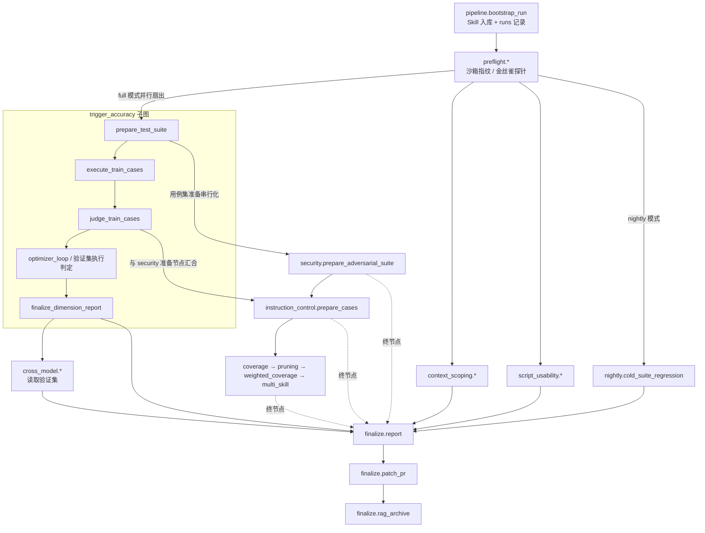
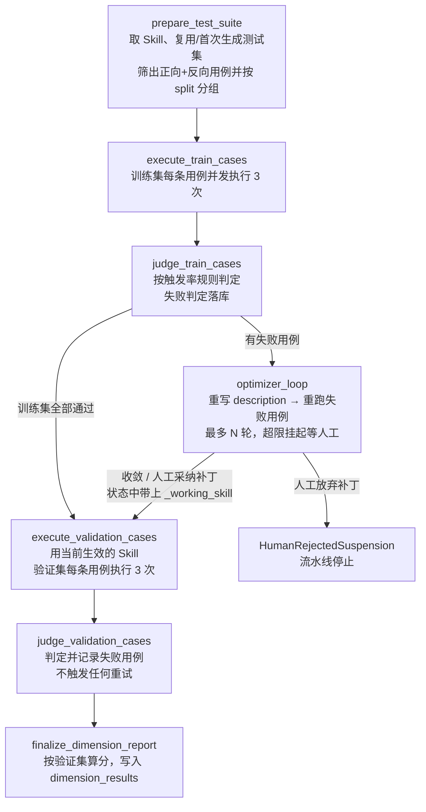
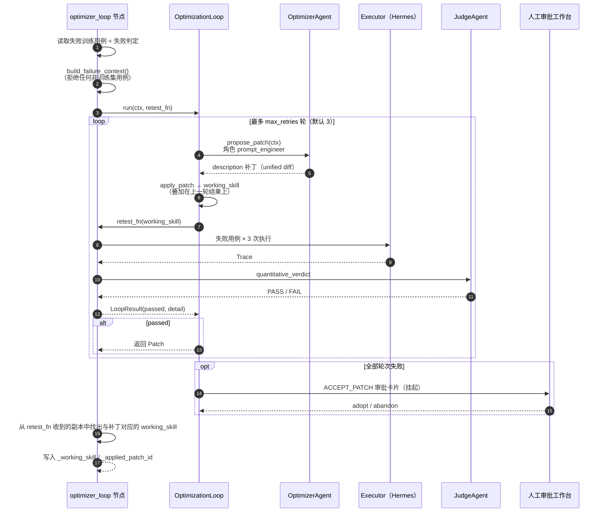

# trigger_accuracy 子图：触发准确度与泛化能力评测

> 代码位置：`src/skill_evaluate/nodes/trigger_accuracy/`
> 主图装配：`src/skill_evaluate/graph/main.py`

---

## 1. 一句话定位

**这张子图回答一个问题：Skill 的 `description` 能不能在该用它的时候把它唤醒，在不该用它的时候保持安静。**

它是整条评测流水线里**第一个真正执行 Skill 的维度**，也是**测试集的生产者**。其余维度要么复用它产出的用例集，要么复用它的执行与判定骨架。

---

## 2. 设计目的：为什么要单独做这张图

### 2.1 description 是 Skill 的"入口闸门"

Agent 决定是否加载某个 Skill 时，**只看得到 description 这一句话，看不到正文**。description 写得不好会出现两种失败：

| 失败类型 | 表现 | 后果 |
|---|---|---|
| 漏触发 | 用户明明在说这件事，Agent 没加载 Skill | Skill 写得再好也用不上 |
| 误触发 | 用户说的是相似但无关的事，Agent 却加载了 | 挤占上下文，甚至把任务带偏 |

如果 description 唤不醒 Skill，后面测指令控制力、安全性、覆盖率都没有意义——测的是一份永远不会被用到的技能。所以本维度被声明为 **`blocking=True`**：判定失败直接阻断合并。

### 2.2 要解决的四个工程难题

| 难题 | 本子图的对策 |
|---|---|
| **LLM 行为不确定**：同一句话这次触发、下次不触发 | 每条用例冗余执行 3 次，按触发率判定（≥2/3 算触发） |
| **"有没有加载"必须是事实，不能是猜测** | 固定使用可插拔完整 Agent（Hermes）真实执行，从调用链里观测是否读取了 `SKILL.md`；不允许降级到 Mini Agent |
| **自动修 description 容易过拟合** | 60/40 划分训练集/验证集；只拿训练集失败去优化，只拿验证集算分；图里**没有**"验证集失败 → 优化"这条边 |
| **自动优化可能永远修不好** | 优化闭环最多重试 N 轮，仍失败则挂起等人工，而不是简单判负 |

### 2.3 在 CI/CD 里的价值

- **默认复用测试集**：流水线重复运行不会重新出题，分数在多次提交之间可比；
- **自动产出修复建议**：训练集失败时 Optimizer 会重写 description，通过验证的补丁最终由主图转成 PR；
- **结论可追溯**：失败判定、补丁、每轮重测结果全部落库，人工审批时有证据可看。

---

## 3. 在整个评测流程中的位置

### 3.1 主图中的拓扑

### 3.2 它与其他模块的关系

本子图有**三重身份**：

**① 测试集的生产者（链头）**

`prepare_test_suite` 是主图里第一个调用 `ensure_test_suite()` 的节点，并回填 `runs.suite_version_id`。主图把各维度的"用例集准备节点"串成 `模块一 → 模块五 → 模块三 → 模块六`。原因是这些节点都可能触发出题：如果并行，第一次运行时会**同时出两套题**，后激活的版本把先激活的那批用例丢掉（数据库层面的 lost update，不报错）。串行化只作用于准备节点，执行与判定照常并行。

**② 下游维度的前置条件**

| 下游 | 依赖点 | 为什么 |
|---|---|---|
| `instruction_control`（模块三） | 等 `judge_train_cases` 完成 | 两者共用同一批用例和 Trace 表，模块三的"不加载 Skill"基线 Trace 不能混进触发率统计 |
| `cross_model`（模块九） | 等本子图终节点完成 | 跨模型泛化要读验证集，且需要知道模块一最终用的是哪版 description |
| `finalize.report` | 终节点是汇合前驱之一 | 报告要等所有维度写完 `dimension_results` |
| `finalize.patch_pr` | 读 `_applied_patch_id` / `_working_skill` | 把通过验证的 description 补丁转成 PR（合入优先级：安全 > 触发准确度 > 指令控制力） |

**③ 可复用的执行与判定骨架**

| 复用方 | 复用了什么 |
|---|---|
| `graph/cold_suite.py`（Nightly COLD 回归） | `run_cases()` 冗余执行 + 触发率规则，号段 240 起 |
| `nodes/security/regression.py`（安全补丁强制功能回归） | 同上，拿打了安全补丁的 Skill 重跑触发率，号段 130 起，确认没有把正常触发改坏 |

所以触发率的判定口径在整个系统里**只有一份**，写在 `rules.py`。

---

## 4. 主要业务流程

### 4.1 子图结构

### 4.2 逐节点说明

#### ① `prepare_test_suite`：准备测试集

1. 按 `skill_id + skill_version_ref` 从库中读取被测 Skill（找不到直接报 `PersistenceError`）；
2. 调用 `TestSuiteService.ensure_test_suite()`：
   - 有与当前版本匹配的 active 用例集 → **直接复用，不调 LLM**；
   - 有用例集但绑定的是旧版本 → **仍复用**，同时带回 staleness 告警（不自动重新出题，否则分数变化无法归因）；
   - 从来没生成过 → 首次生成（正向 8-10 条、反向近脱靶 8-10 条，60/40 划分）；
3. 回填 `runs.suite_version_id`；
4. 只保留 `POSITIVE` / `NEGATIVE` 用例（对抗用例归模块五、多技能用例归模块十），按 `TRAIN` / `VALIDATION` 分组，顺序与用例集一致（保证多次运行结果可 diff）。

#### ② `execute_train_cases`：冗余执行

- 每条训练用例构造 3 个 `ExecutionRequest`（`run_index` 0/1/2，单次超时 90 秒）；
- 通过路由表固定拿到 `PLUGGABLE` 后端（默认 Hermes）；
- 所有请求经 `asyncio.Semaphore(max_concurrent_sandboxes)` 限流，默认同时最多 10 个沙箱；
- 每条 Trace 落库，只把本次新增的 trace id 追加进状态。

后端的容错约定：超时或 Agent 自身异常会返回"失败态 Trace"（按未触发处理）；沙箱建不起来这类**评测系统自身故障**会抛异常，本节点不吞，避免基于残缺证据出分。

#### ③ `judge_train_cases`：量化判定

对每条训练用例：

1. 读回 Trace，**只统计 `run_index < 3` 的那几条**（同一用例还会被模块三、模块五、Nightly 用其他号段执行，混进来会污染触发率）；
2. 折算成 `{"loaded_count": n, "run_count": m}`；
3. 调用 `JudgeAgent.quantitative_verdict()`，正向用例用 `trigger_rate_positive`，反向用例用 `trigger_rate_negative`；
4. FAIL 的判定写库（它们是 Optimizer 的输入，也是人工审查的证据），PASS 的不写。

#### ④ 条件路由 `route_after_train_judge`

`_train_failed_case_ids` 非空 → `optimizer_loop`；否则 → `execute_validation_cases`。

#### ⑤ `optimizer_loop`：description 优化闭环

详见第 6 节。结果只有三种：

| 结果 | 后续 |
|---|---|
| 某一轮补丁让失败的训练用例全部恢复通过 | 状态写入 `_working_skill` / `_applied_patch_id`，进入验证集 |
| 超出重试次数 → 人工在审批卡片上选"采纳" | 同上 |
| 超出重试次数 → 人工选"放弃" | 抛 `HumanRejectedSuspension`，流水线停止，不拿旧 description 假装继续 |

#### ⑥ `execute_validation_cases` / `judge_validation_cases`

与训练集节点是**同一份实现**，只有两处不同：

- 执行时用 `_effective_skill()`：有 `_working_skill` 就用打过补丁的版本，否则用原版——**验证集必须测补丁之后的 description**，才能看出补丁是否真的泛化，还是只迎合了训练集；
- 失败用例写进 `_validation_failed_case_ids`，**只用于报告，不驱动任何重试**。

#### ⑦ `finalize_dimension_report`：写入维度结论

| 情况 | status | score |
|---|---|---|
| 验证集全部通过 | `PASS` | 1.0 |
| 验证集有失败 | `FAIL` | `1 - 失败数 / 验证集总数` |
| 验证集为空 | `NEEDS_HUMAN_REVIEW` | `None` |

`findings` 附带：验证集失败比例、训练集是否进过优化闭环及采纳的补丁 id、测试集 staleness 告警。`blocking` 恒为 `True`。

---

## 5. 判定规则

判定依据是执行后端观测到的 `ExecutionTrace.loaded_skill_md`：

- 优先使用 Hermes 显式上报的 `skill_md_loaded`；
- 没有显式信号时，扫描调用轨迹里是否有 `read_file` 命中 `SKILL.md`；
- 无法确定时判为未加载（宁可漏判触发，不可误判触发）。

| 规则 | 适用 | 通过条件（3 次执行） | 无执行记录时 |
|---|---|---|---|
| `trigger_rate_positive` | 正向用例（should-trigger） | 触发率 ≥ 0.5，即至少 2 次 | FAIL |
| `trigger_rate_negative` | 反向用例（should-not-trigger） | 触发率 < 0.5，即最多 1 次 | FAIL |

"无执行记录判 FAIL"是刻意的：反向用例一次都没跑成，当然"没有误触发"，但那不是证据。判 FAIL 会让它进入优化闭环或出现在报告里，人更容易发现"沙箱其实没跑起来"。

这类判定是纯算术，不走 LLM，因此：不需要声明 `Criticality`、不参与黄金基准盲测、不会被裁判冻结机制拦截。判定仍然经过 `JudgeAgent`，产出的 `JudgeVerdict.model` 形如 `rule:trigger_rate_positive`，报告里可以区分"算出来的"和"判出来的"。

---

## 6. 优化闭环详解

要点：

- **只重跑失败的训练用例，不重新出题**。闭环要看的是同一批题在新 description 下的表现；
- **补丁逐轮叠加**。第 2 轮的补丁打在第 1 轮的结果上，因为第 1 轮往往部分有效，每轮从头来会让模型反复走同一条死路；
- **最终 Skill 从 `retest_fn` 的入参里取，不重新 apply**。最后一个补丁的基线版本是上一轮的工作副本，拿原始 Skill 再打一次必然对不上；
- **Prompt 约束双向**：`description_patch.jinja` 要求写触发场景而非功能罗列、吸收失败用例的真实说法、误触发同样是失败、禁止写模型咒语；节点额外说明了"3 次执行、双向阈值"，提醒模型不要一味把描述写宽；
- **description 补丁不产生磁盘工作副本**，只改内存中的 `SkillDefinition`，不需要清理；
- 超出重试次数时挂起并发出 `ACCEPT_PATCH` 卡片。卡片展示候选补丁 diff、每轮重测结果和重试次数。

---

## 7. 数据与状态

### 7.1 图状态（私有键）

主图状态 `MainGraphState` 合并了各维度的私有键。本子图只读写自己的键：

| 键 | 写入节点 | 读取方 | 含义 |
|---|---|---|---|
| `active_suite_version_id`（公共） | prepare | 全局 | 本次使用的用例集版本 |
| `_trigger_case_ids` | prepare | 排查 | 本维度的全部用例 |
| `_trigger_train_case_ids` | prepare | 训练集执行/判定 | 训练集 |
| `_trigger_validation_case_ids` | prepare | 验证集执行/判定、finalize | 验证集 |
| `_train_failed_case_ids` | judge_train | 路由、optimizer_loop、finalize | 训练集失败用例 |
| `_validation_failed_case_ids` | judge_validation | finalize | 验证集失败用例（仅报告） |
| `_working_skill` | optimizer_loop | 验证集执行、patch_pr | 打了补丁的 Skill（内存版本） |
| `_applied_patch_id` | optimizer_loop | finalize、patch_pr | 采纳的补丁 |
| `_trigger_suite_staleness_warning` | prepare | finalize、finalize.report | 用例集版本漂移告警 |
| `executed_trace_ids`（公共，追加） | 执行节点 | 全局 | Trace id |
| `judge_verdict_ids`（公共，追加） | 判定节点 | 全局 | 判定 id |

两条实现约束：

- **节点签名必须用 `TriggerAccuracyState`**。LangGraph 按节点参数的类型注解裁剪输入状态，写成 `PipelineState` 会让私有键被静默丢掉，节点拿到空用例列表并"成功"跑完；
- **节点只返回增量**。`executed_trace_ids` 等字段的 reducer 是追加，回传整个旧状态会让 id 重复。

除 `_working_skill` 外，状态里只存 id；`_working_skill` 是内存中的补丁版本，库里没有，只能随状态走。

### 7.2 落库数据

| 表 | 写入内容 |
|---|---|
| `runs` | `suite_version_id` 回填 |
| `test_suite_versions` / `test_cases` | 首次生成时由 Generator 写入 |
| `execution_traces` | 每次执行的 Trace，唯一键 `(case_id, run_index)`；闭环重测覆盖原号段，判定永远只看当前版本 |
| `judge_verdicts` | 仅失败的量化判定 |
| `patches` / `patch_application_results` / `node_retry_counts` | 由 OptimizationLoop 写入 |
| `human_approvals` | 闭环超限时的审批卡片 |
| `dimension_results` | `dimension="trigger_accuracy"` 的维度结论 |

### 7.3 Trace 号段

| 号段 | 使用方 |
|---|---|
| 0–2 | 本子图冗余执行（含闭环重测） |
| 100–110 | 模块三 A/B 对比、渐进式披露探查 |
| 130–132 | 模块五安全补丁的触发率回归（复用本子图骨架） |
| 240–242 | Nightly COLD 回归（复用本子图骨架） |

判定时只统计 0–2 号段，其他号段的执行不会影响触发率。

---

## 8. 关键设计决策汇总

| 决策 | 理由 |
|---|---|
| 固定用 PLUGGABLE 后端 | "是否加载 SKILL.md"只有真实执行环境能观测 |
| 冗余次数 3、阈值 0.5 写成常量 | 两者绑定（3 次中至少 2 次），单独调一个会悄悄改变判定语义 |
| 并发上限走配置 | 训练集 20 条 × 3 次 = 60 个沙箱，不限流会压垮调度器 |
| 图结构上没有"验证集 → 优化"的边 | 防过拟合落在结构层；`build_failure_context()` 的训练集校验是第二道闸 |
| 分数只按验证集算 | 训练集已被优化过，计入分数等于给"改过之后当然会通过"打分 |
| 验证集为空判 `NEEDS_HUMAN_REVIEW` | 零用例判 PASS 等于悄悄关掉这个维度 |
| 只归档 FAIL 判定 | 通过判定数量大且没人读；失败判定是优化与审查的证据 |
| 用例集版本漂移不自动重生 | 新旧题混用会让分数变化无法归因；只告警，交给人决定 |
| 闭环超限挂起而不是判负 | 自动修不好的问题最需要人看一眼候选补丁 |
| 人工放弃后直接停止 | 没有可用补丁时，用旧 description 继续跑验证集会产出误导性结论 |

---

## 9. 异常与人工介入

| 场景 | 表现 | 处理 |
|---|---|---|
| 被测 Skill 未入库 | `PersistenceError` | 检查 `bootstrap_run` |
| 沙箱无法创建 | `ExecutorBackendError` 向上抛出 | 修复执行环境后重跑 |
| 单次执行超时 / Agent 异常 | 失败态 Trace，按未触发计 | 自动，体现在触发率里 |
| 等待 Hermes Hook 回调 | 动态 `interrupt()` 挂起 | Hook 到达后由 GraphResumer 唤醒；超时由 reaper 兜底 |
| 首次出题时生成坍塌 | `GenerationCollapseError` | ApprovalGuard 发 `INJECT_NEW_SEED` 卡片，补种子后重跑节点 |
| 优化闭环超出重试次数 | `ACCEPT_PATCH` 卡片，挂起 | 采纳 → 继续验证集；放弃 → `HumanRejectedSuspension`，流水线停止 |

本子图全部节点经 `ApprovalGuardedBuilder` 平铺进主图，上表中的挂起统一由节点级 guard 转成审批卡片。

---

## 10. 输出物

| 输出 | 位置 | 消费方 |
|---|---|---|
| 维度结论（status / score / findings / blocking） | `dimension_results` | `ReportGenerator.build()` → `benchmark.json` / HTML；CI 据 blocking 决定是否阻断 |
| 通过验证的 description 补丁 | `patches` + 状态 `_applied_patch_id` / `_working_skill` | `finalize.patch_pr` 按工作副本渲染出新的 SKILL.md 并创建 PR（人工采纳的补丁会在 PR 正文中标注"未通过自动回归"；PR 不自动合并） |
| staleness 告警 | 状态 + findings | 报告顶部告警条 |
| 结构化日志 | `trigger_accuracy_suite_prepared` / `_cases_executed` / `_cases_judged` / `_patch_adopted` / `_dimension_recorded` | 可观测性、排障 |

---

## 11. 端到端示例

被测 Skill：`csv-cleaner`，description 为"清洗 CSV 导出文件"。

1. **准备**：已有用例集，复用。训练集 12 条、验证集 8 条；
2. **训练集执行**：36 次执行，最多 10 个并发；
3. **训练集判定**：正向用例"帮我把导出的表格去重一下"3 次只触发 1 次 → FAIL（用户说的是"表格"，description 里只有"CSV"）；其余通过；
4. **路由**：有失败 → 进入优化闭环；
5. **优化**：Optimizer 把 description 改为"当用户需要清洗、去重、校验 CSV 或表格导出文件时使用；不适用于 Excel 公式计算"；重跑该用例 3 次全部触发 → 收敛；
6. **验证集执行**：用新 description 跑 8 条 × 3 次；
7. **验证集判定**：反向用例"帮我在 Excel 里写个求和公式"触发 0 次 → 通过；另一条反向用例"把这个 CSV 转成图表"触发 2 次 → FAIL（新描述写宽了）；
8. **报告**：`status=FAIL`，`score=0.875`，`blocking=True`。findings 写明验证集 1/8 失败、训练集进过闭环并采纳补丁 `p-xxx`；
9. **主图收尾**：本维度阻断合并；补丁仍作为参考 PR 提交，由人决定是否继续收窄描述。

这个例子说明了验证集的作用：补丁修好了训练集的漏触发，但在验证集上暴露了新的误触发。由于图中没有验证集回到优化闭环的边，这个问题会如实进入报告，而不会被继续"优化"掉。

---

## 12. 代码地图

| 文件 | 职责 |
|---|---|
| `nodes/trigger_accuracy/__init__.py` | 对外导出；导入时注册触发率规则 |
| `nodes/trigger_accuracy/rules.py` | `trigger_rate_positive` / `trigger_rate_negative`、`trigger_rate_inputs()`、`rule_for_category()` |
| `nodes/trigger_accuracy/state.py` | 维度名、私有状态键、`TriggerAccuracyState` |
| `nodes/trigger_accuracy/deps.py` | 依赖注入：执行后端、Judge、测试集服务、Optimizer、报告器；`REDUNDANT_RUNS=3`、`EXECUTION_TIMEOUT_S=90` |
| `nodes/trigger_accuracy/nodes.py` | `TriggerAccuracyPipeline`：七个节点、路由、`run_cases()` |
| `nodes/trigger_accuracy/graph.py` | `add_trigger_accuracy_nodes()`（平铺进主图）、`build_trigger_accuracy_subgraph()`（独立调试） |
| `graph/main.py` | 主图装配：入口扇出、准备节点串行化、下游依赖边、报告汇合 |
| `graph/cold_suite.py`、`nodes/security/regression.py` | 复用 `run_cases()` 与触发率规则 |
| `tests/skill_evaluate/test_trigger_accuracy.py` | 规则、各节点、闭环、报告口径、图结构与端到端测试 |

相关配置：`SKILLEVAL_EXECUTOR_MAX_CONCURRENT_SANDBOXES`（默认 10）、`SKILLEVAL_OPTIMIZER_MAX_RETRIES`（默认 3）。
