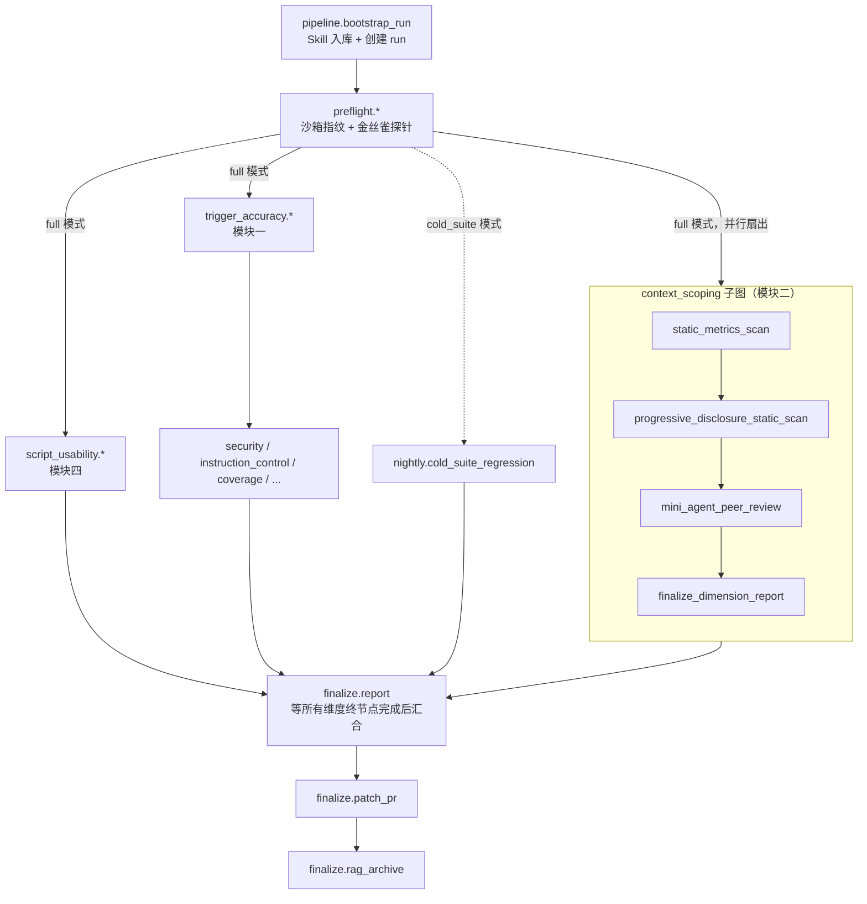
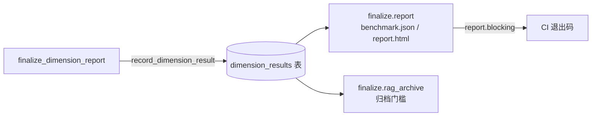
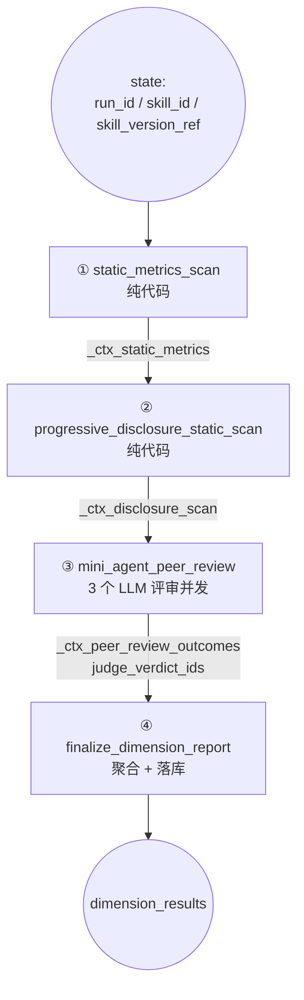
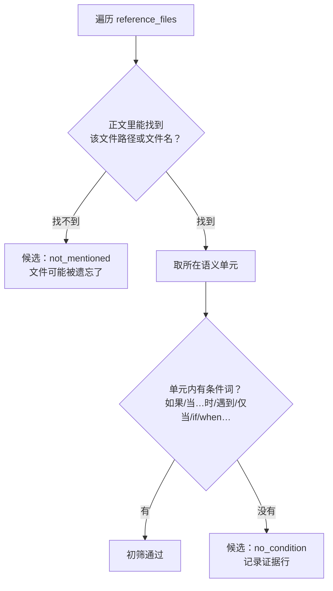
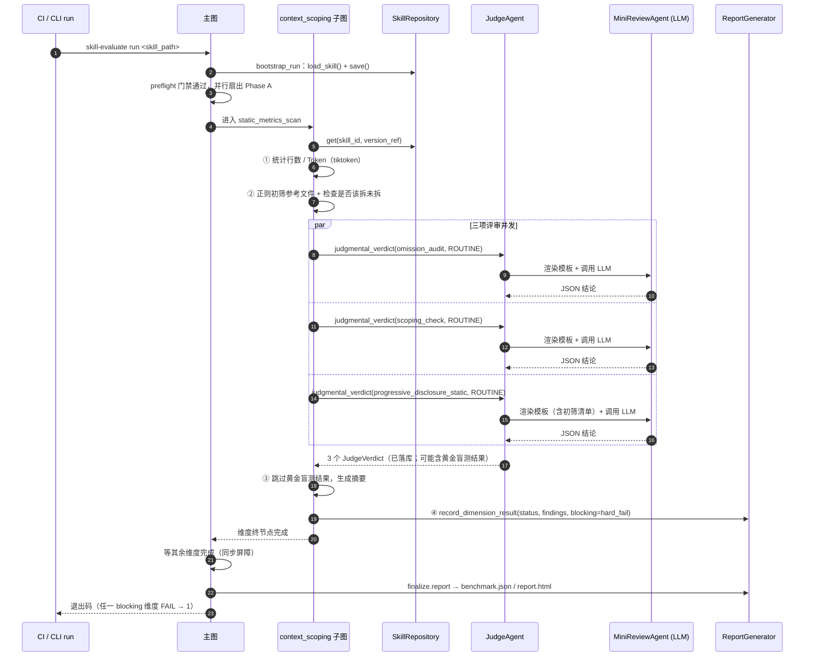
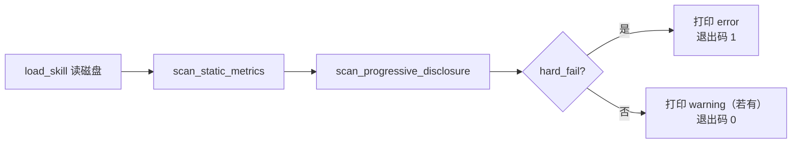

# context_scoping 子图：上下文利用率与范围界定静态评测（模块二）

> 代码位置：`src/skill_evaluate/nodes/context_scoping/`
> 相关实现：`ingestion/token_counter.py`（Token 计数口径）、`agents/mini/templates/`（三个评审模板）、`cli.py::lint`（CI linter 入口）
> 接入文档：`docs/dev/interfaces/12_context_scoping_static_pipeline.md`

---

## 1. 一句话说清楚

**不运行 Skill，只"读"它**：检查一份 `SKILL.md` 放进 Agent 上下文窗口时，是否写得够短、够准、够聚焦，并且把大块参考资料拆成了"有条件才加载"的附属文件。

它是整套评测里**最便宜、最快**的维度：不出测试题、不开沙箱、不跑任务，四个节点一条直线，前两个节点连 LLM 都不调用。

---

## 2. 设计目的

### 2.1 上下文窗口是所有 Skill 共享的公共资源

Agent 一旦加载某个 Skill，`SKILL.md` 的正文就会整段进入上下文。这带来三个直接代价：

| 问题 | 后果 |
|---|---|
| 正文太长 | 挤占其他 Skill、用户对话和工具输出的空间；多个 Skill 同时加载时尤其严重 |
| 写了模型本来就懂的常识 | 花 Token 教模型"什么是 HTTP"，真正需要写清楚的项目约定反而被稀释 |
| 把参考资料一次性塞进正文 | "渐进式披露"失效：本该遇到特定情况才读的错误码表、格式规范，每次都被全量加载 |

所以这个维度要回答的不是"Skill 能不能完成任务"（那是模块三的事），而是**"Skill 占用上下文的方式合不合理"**。

### 2.2 它要检查的四件事

对应架构文档模块二，拆成四项：

1. **体量卡线**：正文 ≤ 500 行、≤ 5,000 Token。
2. **常识剥离度**：正文是否只写模型不可能自己知道的东西（专有约定、隐蔽坑、API 特殊用法）。
3. **范围连贯性**：Skill 是否封装了一个连贯的工作单元——既不能把无关逻辑揉在一起（过宽），也不能窄到完成一件事要加载好几个 Skill（过碎）。
4. **渐进式披露**：`references/` 下每个附属文件，主文档里是否写明了"在什么条件下才去读它"。

### 2.3 为什么做成"静态审查"而不是"真实加载测试"

架构文档在权衡里给了结论：静态审查**极速、成本极低、容易放进 CI**，像传统 linter 一样运行。代价是存在"纸上谈兵"的风险——审查员觉得某句话是常识，但实际执行时模型恰恰需要这句话来校准方向。

本子图对这个风险的回应贯穿了整个设计，核心是一句话：

> **能精确计算的，严格执行；需要主观判断的，只提建议。**

### 2.4 三条关键设计决策

**决策一：硬性数字阻断，主观判断不阻断。**

- 500 行 / 5,000 Token 是能算出来、没有歧义的确定性指标 → 超标即 **Error**，阻断合并。
- 常识剥离、范围连贯性、触发条件是否清楚，由 Mini Agent 判断，本质是**建议** → 只记为 **Warning**，写进报告但不阻断。

理由：如果让 LLM 的主观判断直接卡住合并请求，误报一多，开发者很快会不再信任这条流水线。这一点在代码里落实为 `blocking=hard_fail`——**同一个维度，阻断与否随检查项变化**，而不是整个维度设一个固定值。

**决策二：两级审查——正则初筛 + LLM 复核。**

"这句话算不算明确的加载条件"是语义问题，正则判断不准；但每个文件都丢给 LLM 又浪费钱。所以先用正则把"看起来缺条件"的文件挑出来，再把**初筛结论连同全部文件清单**一起交给 Mini Agent 定性。正则免费但粗糙，LLM 准确但要花钱，正则负责缩小范围。

**决策三：计数不精确时，不拿估算值去阻断。**

Token 计数优先用 `tiktoken` 离线精确计数；如果环境里没有，才退化为"字符数 × 3/4"的估算，并标注 `exact=False`。估算值超标但落在限额 ±15% 内时，不阻断，改为 `NEEDS_HUMAN_REVIEW` 请人确认——一个误差可能达到 15% 的数字，不足以支撑阻断别人合并请求这个动作。

---

## 3. 在整个评测流程中的位置

### 3.1 主图拓扑中的位置



`context_scoping` 是 Phase A 的三个入口之一（另外两个是 `trigger_accuracy` 和 `script_usability`），在前置门禁通过后与它们**并行启动**。

### 3.2 它依赖什么、不依赖什么

| 依赖 | 说明 |
|---|---|
| ✅ `pipeline.bootstrap_run` | 被测 Skill 必须已入库，子图从 `SkillRepository` 读取 |
| ✅ `JudgeAgent` | 三项同行评审统一走 `judgmental_verdict()`，自动获得黄金盲测和冻结保护 |
| ✅ Mini Agent 评审模板 | `omission_audit` / `scoping_check` / `progressive_disclosure_static` |
| ✅ `ReportGenerator` | 把维度结论写入 `dimension_results` |
| ❌ 测试集 | 不出题、不读用例，所以**不用等**模块一产出测试集 |
| ❌ 执行沙箱（Hermes） | 路由表登记为 `MINI` 后端；装配时会核对，若被改成 `PLUGGABLE` 直接报错 |
| ❌ Optimizer 优化闭环 | 正文质量涉及作者意图，不适合交给模型自动改；问题直接报告给人 |
| ❌ 其他维度的状态 | 只读写自己的 `_ctx_*` 私有键，与其他维度无数据耦合 |

因为几乎没有上游依赖，它通常是 Phase A 里**最早跑完**的维度。

### 3.3 它的结论流向哪里



- **报告**：维度状态、findings 原样进入 `benchmark.json` 和 `report.html`。
- **CI 退出码**：`report.blocking = 任一维度 (blocking=True 且 status=FAIL)`。本维度只有硬性超标时才设 `blocking=True`，因此只有这种情况会让 CI 返回退出码 `1`。
- **总状态**：本维度报 `NEEDS_HUMAN_REVIEW` 时，报告总状态会显示 `NEEDS_HUMAN_REVIEW`，但**不改变 CI 退出码**。
- **数据飞轮归档**：归档门槛只看 `blocking=True` 的维度。本维度在正常情况下是非阻断的，**不参与**"是否完全通过"的判断；只有硬性超标（`blocking=True` + `FAIL`）时才会阻止归档。

---

## 4. 四个节点分别做什么



### 4.1 ① `static_metrics_scan`——体量卡线

| 项 | 内容 |
|---|---|
| 输入 | 从库中读出的 `SkillDefinition` |
| 做什么 | 统计正文行数与 Token 数，对比限额 |
| 输出 | `_ctx_static_metrics`（`StaticMetricsResult`） |
| 调 LLM | 否 |

**计算口径**

- 行数 = `body_markdown.splitlines()` 的长度，**不含 YAML frontmatter**（frontmatter 不是给模型读的正文）。
- Token 数 = `count_tokens(body_markdown)`：
  - 装了 `tiktoken` → `o200k_base` 编码精确计数，`exact=True`；
  - 没装 → `字符数 × 0.75`，`exact=False`。

**为什么当场重新计算，而不读库里的 `line_count` / `token_count`**

1. 库里的值可能是很久以前用旧计数器算的，拿它卡线不可靠；
2. "这个数字精不精确"的信息只有当场计算才拿得到，而后面的阻断策略依赖它。

两边不一致时会记一条 `context_scoping_metrics_recomputed` 日志，方便排查"报告里的数字和库里对不上"。

**本节点只产出数字，不做结论。** 是否阻断统一由 ④ 决定，确保阈值判定的逻辑只写在一个地方。

### 4.2 ② `progressive_disclosure_static_scan`——渐进式披露初筛

| 项 | 内容 |
|---|---|
| 输入 | `SkillDefinition` + ① 算出的 Token 数 |
| 做什么 | ① 检查每个参考文件是否写了加载条件；② 检查"正文很大却没拆分" |
| 输出 | `_ctx_disclosure_scan`（`ProgressiveDisclosureScan`） |
| 调 LLM | 否 |

**检查一：每个 `references/` 文件有没有加载条件**



"语义单元"是这一步准确性的关键：

- **列表项**：只看该项本身及其缩进续行。上一个列表项里写的"当……时"，不能算作下一项的条件。
- **普通段落**：以空行为界的整个自然段。条件写在上一句、文件名在下一句，只要在同一段就算数。

为什么不在全文里搜条件词？几乎每篇 `SKILL.md` 都会出现"如果""当……时"，全文搜索的结果必然是全部通过，这项检查就等于没做。

两类候选要区分开，因为它们对作者意味着不同的问题：`not_mentioned` 通常是文件被遗忘，`no_condition` 是渐进式披露没写完。

**检查二：正文已接近限额，却没有任何参考文件**

正文达到限额的 80%（默认约 400 行或 4,000 Token），且 `references/` 为空 → 标记 `bulk_inline_without_references`。在接近上限时就提醒，作者只需要挪出一节内容；等超标后再提醒，就要大改。

**这一步允许误报。** 正则初筛结果是交给 ③ 复核的线索，本身不作最终结论。

### 4.3 ③ `mini_agent_peer_review`——三项同行评审

| 项 | 内容 |
|---|---|
| 输入 | `SkillDefinition` + ② 的初筛结果 |
| 做什么 | 并发调用三个评审模板，统一经过 `JudgeAgent` |
| 输出 | `_ctx_peer_review_outcomes`（结论摘要）、`judge_verdict_ids`（追加） |
| 调 LLM | 是，3 次 Mini 档模型请求（温度 0.1） |

| 模板 | 检查什么 | 喂给模型的内容 |
|---|---|---|
| `omission_audit` | 常识剥离度：逐条找出"模型本来就懂"的说明 | `skill_md` |
| `scoping_check` | 范围连贯性：`too_broad` / `too_fragmented` / 正常 | `skill_md` |
| `progressive_disclosure_static` | 每个参考文件是否有可执行的加载条件 | `skill_md` + `reference_files` |

**`reference_files` 的内容是怎么来的**

由 `format_reference_files_for_review()` 渲染，每行一个文件：

```
- references/a.md | 正则初筛：正文中该文件附近存在条件性表述 | 相关行：遇到编码问题时读 references/a.md。
- references/b.md | 正则初筛：正文提及了该文件，但附近没有条件性表述 | 相关行：详见 references/b.md。
```

**合格的文件也会一起列出来。** 如果只给模型看可疑项，它倾向于把每一项都判成问题；给出完整清单，模型才有对照。

**为什么全部声明为 `Criticality.ROUTINE`**

`CRITICAL` 会触发三副本共识投票，花 3 倍 Token，这是留给"高危安全漏洞""覆盖率不足以合并"这类后果严重的判定的。本维度的主观审查本来就只是参考，降低结论的强制力（不阻断）比花三倍成本投票更合适。

**评审模板里的"宽容原则"**

所有模板共用一段前缀规则，其中第二条是：**证据不足时倾向于给 pass**，并在 reasoning 里写明不确定性。这与架构文档"在判定阈值上保留宽容度"一致，也是在 Prompt 层面应对"纸上谈兵"风险。

**两种特殊返回的处理（在 `_to_outcome()` 中）**

1. **黄金基准盲测**：`JudgeAgent` 有 2% 的概率把真实请求替换成一条人工标定过的黄金用例，用来考核裁判自己。这类结果的 `subject_id` 带 `__golden__:` 前缀，**必须跳过**，不能当作本 Skill 的结论。跳过的项会带上 `skipped_reason`，并在报告里说明"这一项本次没有产生结论"。
2. **共识未达成**：正常情况下不会出现（本维度用的是 `ROUTINE`）。如果以后有人把重要度调成 `CRITICAL` 且三副本意见不一致，会抛出 `PipelineSuspended` 等待人工仲裁，**不会**把"待人工复核"悄悄降级成通过或失败。

**状态里只存摘要。** 完整的 `JudgeVerdict` 已经由 Judge 写入数据库，状态里只保留模板名、结论、verdict_id 和前 200 字的推理摘录，避免每个 checkpoint 都带上几十 KB 的推理文本。

### 4.4 ④ `finalize_dimension_report`——聚合与落库

| 项 | 内容 |
|---|---|
| 输入 | 前三个节点写入的私有键 |
| 做什么 | 按判定口径得出维度状态、是否阻断，生成 findings |
| 输出 | 调用 `record_dimension_result()` 写库；节点返回空增量 |

判定口径见第 7 节。findings 的组成：

1. **始终写一条静态指标摘要**，例如 `静态指标：320/500 行，4100/5000 Token（计数口径 tiktoken:o200k_base）`。即使没超标也写，这样读报告的人能看出是勉强过线还是余量充足，以及数字是否精确。
2. 超标说明（行数 / Token），或"估算值落在不确定带，需人工确认"。
3. 渐进式披露初筛发现（明确标注"正则初筛，以同行评审结论为准"）。
4. 同行评审未通过的项（明确标注"非阻断，供人工参考"）。
5. 被黄金盲测占用、未产生结论的项。

`score` 固定为 `None`。三项检查性质完全不同，硬凑一个"通过项数 / 总项数"的分数会把它们平均掉，没有意义。

---

## 5. 状态流转

本子图在主图状态中只使用三个私有键，都以 `_ctx_` 为前缀：

| 键 | 类型 | 写入者 | 读取者 |
|---|---|---|---|
| `_ctx_static_metrics` | `StaticMetricsResult` 的 dict | ① | ②、④ |
| `_ctx_disclosure_scan` | `ProgressiveDisclosureScan` 的 dict | ② | ③、④ |
| `_ctx_peer_review_outcomes` | `list[PeerReviewOutcome]` 的 dict | ③ | ④ |
| `judge_verdict_ids`（公共字段） | `list[str]`，reducer 为追加 | ③ | 报告 / 审计 |

有两个实现细节容易出错：

- **节点签名必须用 `ContextScopingState`，主图 schema 必须包含这些私有键。** LangGraph 会按 schema 裁剪状态，漏掉的键会被**静默丢弃**。主图的 `MainGraphState` 已经继承了 `ContextScopingState`；即便以后出了问题，④ 也会报 `NEEDS_HUMAN_REVIEW` 并点名缺哪个键，而不是误报 PASS。
- **节点只返回增量。** `judge_verdict_ids` 是追加型字段，把整个旧状态返回回去会让已有 id 重复一遍。

另外，① 和 ② **必须串行**：② 要用 ① 刚算出的 Token 数判断"是否接近限额"。两个节点都是纯计算，串行几乎没有耗时代价。

---

## 6. 主要业务流程

### 6.1 一次 PR 评测的完整时序



### 6.2 四个典型场景

**场景 A：写得好的 Skill**

- 320 行 / 3,900 Token（精确计数）；两个参考文件都写了"遇到……时读取"；三项评审均通过。
- 结果：`PASS`，`blocking=False`。findings 只有一条静态指标摘要。

**场景 B：正文超标**

- 620 行。
- 结果：`FAIL`，`blocking=True` → 报告 `blocking=True` → **CI 退出码 1，合并被阻断**。
- findings 会提示"请把长配置或参考资料移到 references/ 目录按需加载"。即使三项评审全部通过，结论也是 FAIL。

**场景 C：体量合格，但写了很多常识**

- 280 行；`omission_audit` 判定 FAIL，并摘录出"HTTP 是无状态协议"等句子。
- 结果：`FAIL`，但 `blocking=False` → **CI 不阻断**。报告里会出现 `[omission_audit] Mini Agent 审查未通过（非阻断，供人工参考）：……`，由作者自行判断是否删减。

**场景 D：CI 环境没装 tiktoken，正文在限额附近**

- 估算 Token 5,200（`exact=False`），落在 5,000 ±15% 区间内。
- 结果：`NEEDS_HUMAN_REVIEW`，`blocking=False`。报告总状态显示待人工复核，但 CI 退出码不受影响。findings 会建议安装 `tiktoken` 获得精确计数。
- 如果估算值是 9,000，远超误差范围，仍按硬性超标处理并阻断。

### 6.3 另一条轻量流程：`skill-evaluate lint`

完整子图需要 Postgres（读 Skill、写结论）和 LLM（同行评审）。为了让模块二能像 linter 一样在最基础的 CI 作业里运行，额外提供了一个命令，只执行两个纯代码扫描器：

```bash
skill-evaluate lint --skill-path skills/csv-cleaner
```



| | `lint` 命令 | 完整子图 |
|---|---|---|
| 需要数据库 | 否 | 是 |
| 需要 LLM | 否 | 是（3 次调用） |
| 检查项 | 体量卡线 + 渐进式披露初筛 | 四项全部 |
| 输出 | 终端文本 + 退出码 | `dimension_results` + 报告 |
| 适用场景 | 提交前自查、轻量 CI 作业 | 正式 PR 评测流水线 |

两者使用同一套扫描函数和同一份配置，结论口径一致。

---

## 7. 判定口径

维度状态的优先级：**FAIL > NEEDS_HUMAN_REVIEW > PASS**。已经有确定问题时，不会因为另有一项需要人工确认而把结论弱化成"待定"。

| 情形 | status | blocking | CI 影响 |
|---|---|---|---|
| 行数超标（永远精确） | `FAIL` | **True** | 退出码 1 |
| Token 超标（精确计数，或估算值远超误差范围） | `FAIL` | **True** | 退出码 1 |
| Token 估算值超标，但在限额 ±15% 内 | `NEEDS_HUMAN_REVIEW` | False | 无 |
| 仅同行评审有 FAIL | `FAIL` | False | 无 |
| 三项评审全部被黄金盲测占用 | `NEEDS_HUMAN_REVIEW` | False | 无 |
| 取不到静态指标（主图 schema 漏键等） | `NEEDS_HUMAN_REVIEW` | False | 无 |
| 其余情况 | `PASS` | False | 无 |

注意：**渐进式披露的正则初筛本身不改变状态**。它只生成 findings，最终定性依赖 `progressive_disclosure_static` 评审的结果。

---

## 8. 异常与边界情况

| 情况 | 处理方式 | 原因 |
|---|---|---|
| Skill 未入库 | 抛 `PersistenceError` | 前置条件不满足，继续运行没有意义 |
| 路由表把本维度改成 `PLUGGABLE` | 装配主图时抛 `ConfigurationError` | 本维度不执行任务，无法兑现该声明，提前报错比运行时不一致更好 |
| 裁判被冻结（`JudgeFrozenError`） | 不捕获，由 `ApprovalGuard` 转为"解冻裁判"审批卡片，解冻后重跑节点 | 已被证明会误判的裁判给出的结论不应进入报告 |
| 共识未达成 | 抛 `PipelineSuspended`，由 `ApprovalGuard` 生成审批卡片 | `NEEDS_HUMAN_REVIEW` 不允许被降级为 PASS/FAIL |
| 黄金盲测注入 | 跳过该项，在 findings 中说明 | 黄金用例的结论不属于本 Skill |
| 评审模板缺少变量 | 发请求前抛 `ReviewTemplateError` | 避免发出内容不完整的 Prompt |
| 没装 `tiktoken` / 词表加载失败 | 记录日志，退化为字符估算并标注不精确 | 计数器降级不应导致整个评测失败 |

本维度**不读取**模块一优化闭环产生的 `_working_skill`（内存中打了 description 补丁的版本）。它审查的是仓库里 `SKILL.md` 的原文，这样报告内容才能与开发者实际看到的文件对应。

---

## 9. 配置项

均可通过环境变量覆盖（前缀 `SKILLEVAL_CONTEXT_SCOPING_`）：

| 配置 | 默认值 | 作用 |
|---|---|---|
| `LINE_LIMIT` | `500` | 行数上限 |
| `TOKEN_LIMIT` | `5000` | Token 上限 |
| `ESTIMATE_UNCERTAINTY_RATIO` | `0.15` | 估算值的不确定区间宽度；精确计数时不生效 |
| `MAX_REFERENCE_FILES_WITHOUT_TRIGGER` | `0` | 初筛命中数的**整体**容忍度：命中数不超过该值时，初筛发现一条都不报 |
| `BULK_INLINE_RATIO` | `0.8` | 正文达到限额的该比例且没有参考文件时，提示"该拆未拆" |

同行评审的温度使用 Mini Agent 的默认值 `0.1`，本维度不单独配置。

阈值可配置是为了让团队按自己的规范调整，**不应该**用于在 CI 中临时放宽限额以让某次合并通过。

---

## 10. 已知局限与可调优方向

1. **静态审查的固有局限仍然存在。** 模型认为是"常识"的说明，实际执行时可能正是关键提示。当前的应对是非阻断 + Prompt 层面的宽容原则；真实加载效果由模块三（指令控制度与执行效果）通过 A/B 对比来验证。
2. **正则条件词表是启发式的。** 例如"需要""只有"这类词可能出现在与加载条件无关的句子里，导致漏报；这类情况依赖 LLM 复核兜底。
3. **`tiktoken` 的 `o200k_base` 编码不是 Claude 的原生分词器**，只是一个离线、确定性的代理口径。与 Claude 实际 Token 数会有偏差，但同一份 Skill 在不同运行之间结果稳定、可比较。如需官方计数，可实现 `TokenCounter` 协议并注入 `ContextScopingDeps.token_counter`。
4. **主观审查是否应升级为阻断项**是一个待定的运维决策。积累足够的报告数据后，若发现误报率可接受而漏报代价较大，只需修改 `nodes.py` 中 `blocking=hard_fail` 这一处。如果同时把重要度调成 `CRITICAL`，共识未达成时的人工仲裁路径已经实现。
5. **与数据飞轮归档的关系**：本维度在非超标情况下是非阻断的，因此同行评审 FAIL **不会**阻止该次运行被归档为"成功经验"。如果希望"常识过多"的 Skill 不进入经验库，需要调整归档门槛，而不是修改本维度的阻断策略。

---

## 11. 代码导航

| 想了解 | 看这里 |
|---|---|
| 四个节点的实现与判定口径 | `nodes/context_scoping/nodes.py` |
| 行数/Token 卡线、正则初筛、清单渲染 | `nodes/context_scoping/static_scan.py` |
| 私有状态键 | `nodes/context_scoping/state.py` |
| 依赖注入、重要度声明、路由核对 | `nodes/context_scoping/deps.py` |
| 子图装配（给主图 / 独立调试） | `nodes/context_scoping/graph.py` |
| Token 计数口径 | `ingestion/token_counter.py` |
| 三个评审模板的 Prompt | `agents/mini/templates/{omission_audit,scoping_check,progressive_disclosure_static}.jinja` |
| 模板共用的宽容原则 | `agents/mini/templates/_prefix.jinja` |
| 阈值配置 | `config.py::ContextScopingSettings` |
| 在主图中的装配 | `graph/main.py`（`PHASE_A_ENTRY_NODES`、`DIMENSION_TERMINAL_NODES`） |
| CI linter 入口 | `cli.py::lint` |
| 测试 | `tests/skill_evaluate/test_context_scoping.py` |
