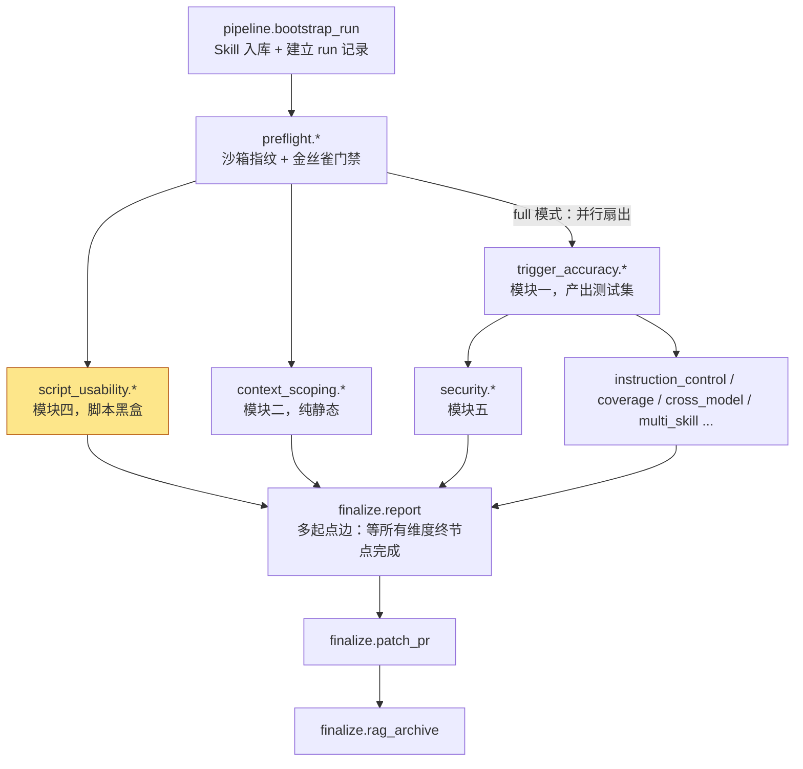
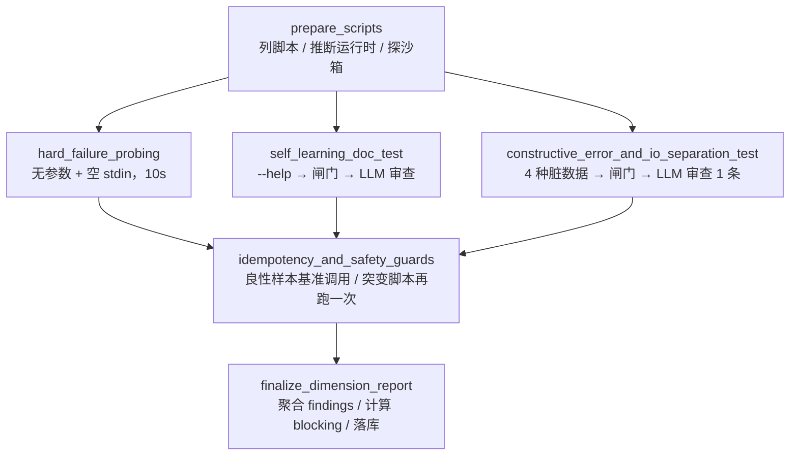

# script_usability 子图：脚本接口的智能体易用性黑盒探测（模块四）

> 代码位置：`src/skill_evaluate/nodes/script_usability/`
> 执行组件：`src/skill_evaluate/executors/script_sandbox.py`（`ScriptSandboxRunner`）
> 相关实现：`ingestion/skill_loader.py::detect_mutating_script()`、`agents/mini/templates/`（模板 `help_doc_quality` / `constructive_error`）
> 开发文档：`docs/dev/14_模块四_脚本接口的智能体易用性黑盒探测.md`
> 接入文档：`docs/dev/interfaces/14_script_usability_probing.md`

---

## 1. 一句话说清楚

**把 Skill 附带的 `scripts/` 当成一个陌生的命令行工具，替 Agent 先"试用"一遍**：缺参数时会不会卡住、`--help` 能不能教会调用者、喂错数据时报错有没有用、重复执行会不会崩、输出会不会刷屏。

它不看 `SKILL.md` 写得好不好（那是模块二、模块三的事），也不关心脚本的业务逻辑对不对。它只回答一个问题：

> **一个没有终端、看不到源码、只能读输出的 Agent，能不能顺利地把这个脚本用起来？**

---

## 2. 设计目的

### 2.1 为什么脚本需要单独评测

复杂的 Skill 常常在 `scripts/` 下带几个本地脚本，由 Agent 在执行任务时调用。人用得顺手的脚本，Agent 不一定用得了，因为两者的使用条件完全不同：

| 人类调用者 | Agent 调用者 |
|---|---|
| 有终端，脚本问"确认删除吗？(Y/N)"可以回答 | **没有 TTY**，脚本一问就永远等下去 |
| 看不懂可以翻源码、问同事 | **只能读 `--help`** 的输出来学怎么调用 |
| 看到 `Traceback` 能自己定位问题 | 拿到裸堆栈只能**瞎猜着重试** |
| 重试前会先确认上次跑到了哪一步 | 失败后**直接再跑一次**，第二次撞上"文件已存在" |
| 输出太长就滚动屏幕 | 输出直接进**上下文窗口**，太长会把前面的信息挤掉 |

这些问题在人工使用时几乎不会暴露，一到 Agent 自动执行就变成卡死、死循环或任务中断。本子图就是在 CI 里把这些问题提前找出来。

### 2.2 四项检查

对应架构文档模块四：

| # | 检查项 | 模拟的 Agent 场景 | 结论性质 |
|---|---|---|---|
| 1 | **非交互性（挂起）** | Agent 忘了传某个参数 | 确定性事实 → **致命、阻断** |
| 2 | **`--help` 自学习能力** | Agent 第一次见到这个脚本，先看帮助 | LLM 主观审查 → 告警 |
| 3 | **建设性报错 + 流隔离** | Agent 传了格式错误的数据 | LLM 审查 + 启发式补充信号 → 告警 |
| 4 | **幂等性 + 防刷屏** | Agent 失败后重跑一次 / 脚本输出巨量内容 | 崩溃 → **阻断**；输出超限 → 告警 |

### 2.3 为什么用"黑盒探测"而不是静态代码分析

架构文档在权衡里给了结论，本子图照此执行：

- **黑盒探测与语言无关**：Python、Bash、Node.js、Ruby、PowerShell 用同一套方法测，不用为每种语言写一个 AST 分析器。
- **静态分析抓不住挂起**：脚本是在读 `/dev/tty`、在等锁，还是在轮询网络？只看代码很难判断，真跑一次最可靠。
- **代价是需要隔离环境**：真跑脚本就要防止它污染宿主机。所以每次探测都在一次性容器 + 独立临时目录里进行（见第 6 节）。

### 2.4 贯穿全子图的四条设计决策

**决策一：确定性事实阻断，主观判断只告警。**

与模块二、模块三的原则一致。"挂起了没有""第二次是不是崩了"有明确答案，判定失败就阻断合并；"帮助文档写得够不够清楚""报错够不够建设性"由 LLM 判断，误报一多开发者就不会再信任这条流水线，所以只写进报告。

**决策二：所有通过/失败结论都经过 `JudgeAgent`，包括确定性的那些。**

确定性结论走 `quantitative_verdict()` + `rules.py` 里注册的五条规则，主观结论走 `judgmental_verdict()`。节点代码里没有自己写"判失败"的地方。这样每一条阻断合并的结论都能在裁判记录里查到依据，黄金盲测、失误率冻结等可信度机制也不会被绕过。

**决策三："没测到"绝不等于"通过"。**

沙箱起不来、脚本文件不在评测机上、推断不出用什么解释器、判断不了脚本会不会写文件，这些情况一律如实写进报告，维度状态判 `NEEDS_HUMAN_REVIEW`。宁可让人看一眼，也不给一个空洞的 PASS。

**决策四：宁可漏报，不可误报阻断。**

本子图最大的不确定性是：**我们并不知道任意一个脚本的参数长什么样**，只能按最常见的约定（`--input <文件>`）去试。所以凡是"可能只是我们没调对"的情况，都不作为阻断依据。最典型的是幂等性：第一次调用就失败时，直接跳过幂等性判定，而不是把第二次的报错算成"崩溃"。

---

## 3. 在整个评测流程中的位置

### 3.1 主图中的位置



（完整拓扑以 `src/skill_evaluate/graph/main.py` 模块头为准。）

### 3.2 它在整条流水线里的三个特点

**① 起跑最早，与谁都不抢资源。**

`script_usability.prepare_scripts` 属于 `PHASE_A_ENTRY_NODES`：前置门禁一通过，它就和模块一、模块二**同时**开跑。原因是它**不依赖测试集**——探测对象是磁盘上的真实脚本，"用例"由代码按固定模式生成，不经过 Generator，也不读模块一的用例。主图为了避免多个维度同时出题而把"准备用例集"的节点串行化（模块一 → 五 → 三 → 六），本子图完全不受这条串行链影响。

**② 不产生 `ExecutionTrace`，与其他维度的统计数据互不干扰。**

模块一、三、五、九、十都往 `execution_traces` 表写执行轨迹，并共用一张 `run_index` 号段分配表来避免互相覆盖。本子图裸调子进程，**一条 Trace 都不写**，所以不需要申领号段，其他维度按用例聚合 Trace 时也不必过滤它。

**③ 终节点参与最终汇合，`blocking` 直接影响合并门禁。**

`script_usability.finalize_dimension_report` 是 `DIMENSION_TERMINAL_NODES` 之一。`finalize.report` 用多起点边等待所有维度完成后才生成报告。报告层的规则是：**任一维度 `blocking=True` 且 `status=FAIL`，整体结论即为 FAIL**。因此本子图发现的"挂起"或"幂等性崩溃"会直接让这次合并请求被拦下。

### 3.3 与其他模块的关系

| 模块 | 关系 |
|---|---|
| 模块二 `context_scoping` | 同为 Phase A 并行维度，互不依赖。模块二审"文档"，本模块审"脚本" |
| 模块五 `security` | **复用本模块**：`security/detectors.py` 直接使用 `looks_like_unhandled_crash()`；红队脚本注入测试沿用 `ScriptSandboxRunner` 的沙箱约定。本模块只做格式层的脏数据，命令注入这类攻击性负载留给模块五 |
| `JudgeAgent`（文档 08） | 所有判定的唯一入口；本模块注册了 5 条量化规则、复用 2 个 Mini Agent 评审模板 |
| `skill_loader`（文档 06/12） | 解析 Skill 时给每个脚本标注 `is_mutating`，本模块据此决定要不要做幂等性测试 |
| 人工审批（文档 22） | 本模块本身没有审批点。只有当 LLM 审查被调成三副本共识且没达成一致时，才会抛 `PipelineSuspended`，由主图的 approval guard 转成审批卡片 |
| 优化闭环（文档 09） | **不接入**。脚本缺陷的修复取决于作者的实现意图，不是模型能自动改好的局部问题，所以直接报告给人 |

---

## 4. 子图结构



| 节点 | 做什么 | 调 LLM | 起容器 | 写入的私有状态键 |
|---|---|---|---|---|
| `prepare_scripts` | 读 Skill、生成探测目标、检查沙箱可用性 | 否 | 否 | `_su_targets` / `_su_prepare_findings` / `_su_sandbox_unavailable` |
| `hard_failure_probing` | 非交互性挂起测试 | 否 | 每个脚本 1 个 | `_su_hard_failure_findings` |
| `self_learning_doc_test` | `--help` 文档质量 | 有输出时 1 次 | 每个脚本 1 个 | `_su_help_outcomes` |
| `constructive_error_and_io_separation_test` | 脏数据容错 + 流隔离 | 有报错时 1 次 | 每个脚本 4 个（串行） | `_su_error_outcomes` |
| `idempotency_and_safety_guards` | 幂等性 + 输出体量 | 否 | 每个脚本 1~2 个 | `_su_idempotency_findings` |
| `finalize_dimension_report` | 汇总、判定、写 `dimension_results` | 否 | 否 | — |

**为什么三条支路并行、幂等性排在最后？** 前三项只是"调一下看反应"，互不影响；幂等性测试会真的让脚本写东西，放到最后执行，可以避免并发压力影响超时判定的可复现性。

**为什么用静态边而不是 `Send`？** 三条支路是结构不同的固定逻辑，节点数在编译期就确定，不属于"运行时才知道要派生多少分支"的场景。静态边能在图上直接看到结构。多个脚本之间的并发发生在**节点内部**（`asyncio.gather` + 信号量）。

---

## 5. 主要业务流程

下面以一个假想的 Skill 为例：它带有 `scripts/clean_csv.py`（读取 CSV、清洗后写出 `out.csv`）。

### 5.1 `prepare_scripts`：弄清楚"测什么、怎么跑"

1. 从 `SkillRepository` 读出 Skill，拿到 `scripts` 列表。
2. 对每个脚本生成一个 `ScriptProbeTarget`：
   - **文件在不在评测机上？** Skill 可能是在另一台机器上解析入库的，`root_path` 未必存在。不存在 → 标记 `skip_reason`。
   - **用什么解释器？** 先看 shebang，再看扩展名。`clean_csv.py` → 镜像 `python:3.13-slim`，解释器 `python`。推断不出 → 标记 `skip_reason`，不去猜。
   - **会不会写外部状态？** 直接沿用解析阶段标注的 `is_mutating`。脚本里有 `open(..., "w")` → `True`。
3. 只要有脚本，就先探一次沙箱（`docker version`）。不可用时写入 `_su_sandbox_unavailable`，后面三条支路全部空转，最终判 `NEEDS_HUMAN_REVIEW`。

> 没有 `scripts/` 目录的 Skill 不会去探沙箱，最终维度判 PASS 并附一条提示——"这份 Skill 不带脚本"是文件系统上可以确定的事实，不代表流水线出了问题。

### 5.2 `hard_failure_probing`：缺参数时会不会卡住

```
docker run --rm -i --network=none ... python:3.13-slim  python scripts/clean_csv.py
                                                         └─ 不带任何参数，stdin 立即 EOF
```

- 超时时间是专用的 **10 秒**，而不是常规执行的 60 秒。合格的脚本应该立刻打印用法并退出，10 秒已经很宽松。
- 规则 `script_non_interactive`：**超时 = FAIL**。退出码不参与判定，缺参数时以非 0 退出正是期望行为。
- 失败时写入一条 `[致命]` finding，并把判定落库作为证据。这是本子图两个阻断项之一。

### 5.3 `self_learning_doc_test`：`--help` 能不能教会 Agent

1. 执行 `python scripts/clean_csv.py --help`。
2. 取 stdout，为空时取 stderr（很多脚本把用法打到 stderr 并以 2 退出，这仍然算有效文档）。
3. **确定性闸门** `script_help_responsive`：两个流都为空 → 直接判 FAIL，**不调用 LLM**（审查空字符串没有意义）。
4. 有输出 → 交给模板 `help_doc_quality` 审查三项，**全部满足才通过**：
   - 是否列出全部参数，并说明作用和是否必填；
   - 是否写明依赖的环境变量；
   - 是否有一条可以直接复制执行的完整示例。
5. 结果是非阻断的告警。

### 5.4 `constructive_error_and_io_separation_test`：喂错数据时报错有没有用

在同一个临时工作区里，依次用 4 种预置脏数据调用 `python scripts/clean_csv.py --input <负载>`：

| 模式 | 内容 | 想看出什么 |
|---|---|---|
| `malformed_json` | 扩展名 `.csv`，内容是截断的 JSON | 格式与类型都不匹配时怎么报 |
| `missing_required_field` | 合法 CSV，但缺少必填列 | 只做格式校验，还是会指出缺哪个字段 |
| `non_utf8_bytes` | 非 UTF-8 字节流 | 解码失败时有没有兜底 |
| `oversized_string` | 64KB 字面量参数 | 对参数长度有没有防护 |

然后分三步判定：

1. **确定性闸门** `script_rejects_dirty_input`：至少有一种被拒绝（非 0 退出）才通过。**4 种全部 exit 0** 说明脚本把垃圾数据全收了，Agent 拿不到任何"输入有问题"的信号，判 FAIL，不调 LLM。
2. **只挑一条报错交给 LLM**：优先选"被拒绝且 stderr 非空"的那条，交给模板 `constructive_error` 审查三项：说清出了什么错、期望什么输入、下一步该怎么做。同一脚本的几条报错通常来自同一套错误处理代码，逐条审查只会得到重复结论。
3. **流隔离补充检查**（`check_io_separation`）：失败时 stdout 里出现 `Traceback`、`Error` 等特征就算不合格——干净数据应该走 stdout，方便 Agent 做管道处理；诊断信息应该走 stderr。这只是**补充信号**，写进 `detail`，不改变判定结果。

> **为什么跑 4 种、只审 1 次？** 单一模式常常打不中脚本的输入类型，比如给只收数字的参数传一个坏文件，只能拿回"文件不存在"，据此评价报错质量没有意义。多跑几次子进程比多调一次 LLM 便宜得多。

### 5.5 `idempotency_and_safety_guards`：重复执行和输出体量

对每个可运行脚本：

1. 在一个新工作区里写入一份**合法的**小 CSV 样本，执行一次**基准调用** `--input skilleval_benign_sample.csv`。
2. **输出体量检查**（所有脚本都做）：规则 `script_output_bounded`，看的是**截断前**的原始字节数，超过 32KB 记 `[警告]`。评测系统自己会把输出截到 32KB，如果拿截断后的长度去判，就发现不了"脚本本身没做截断"。
3. **幂等性检查**，按 `is_mutating` 分三种情况：

| `is_mutating` | 处理 |
|---|---|
| `False` | 只读脚本，跑两次结果必然一样，跳过 |
| `None` | 判断不了，跳过，写 `[提示] 建议人工确认` |
| `True` | 见下 |

   - 基准调用**失败** → 说明参数约定和我们猜的不一样，没把脚本调起来。**跳过幂等性判定**，写 `[提示] 无法构造有效的连续执行场景`。这是防误报的关键一步。
   - 基准调用**成功** → 在**同一个工作区**再执行一次（必须能看到第一次留下的文件，"状态已存在"的场景才会出现）。规则 `script_idempotent`：第二次出现**未处理的崩溃**才判 FAIL，并写 `[阻断]`。

   "未处理的崩溃"只包括裸堆栈、`FileExistsError`、`EEXIST`、唯一键冲突、段错误等。像 `错误：out.csv 已存在，请加 --force 覆盖` 这样的报错**不算崩溃**，这恰恰是正确处理了"状态已存在"。

### 5.6 `finalize_dimension_report`：汇总成一条维度结论

把前面各节点的产出汇总成 findings，按严重级前缀分类：

| 前缀 | 来源 | 是否阻断 |
|---|---|---|
| `[致命]` | 挂起 | **是** |
| `[阻断]` | 幂等性崩溃 | **是** |
| `[警告]` | 帮助文档 / 报错质量不合格、输出超限、脚本跑不起来、沙箱不可用 | 否 |
| `[提示]` | 无法判定是否突变、基准调用失败、黄金盲测占用、流隔离补充信号 | 否 |

状态按优先级计算：**FAIL > NEEDS_HUMAN_REVIEW > PASS**

| 情形 | status | blocking |
|---|---|---|
| 有挂起或幂等性崩溃 | FAIL | **True** |
| 只有主观审查不合格 / 输出超限 | FAIL | False |
| 沙箱不可用 / 有脚本跑不起来 / 有"无法判定"项 | NEEDS_HUMAN_REVIEW | False |
| 没有 `scripts/` | PASS（附提示） | False |
| 其余 | PASS | False |

`score` 固定为 `None`：四项检查性质完全不同，硬算"通过项/总项数"会得到一个没有实际含义的数字。

最后调用 `ReportGenerator.record_dimension_result()` 写入 `dimension_results` 表，等待主图的 `finalize.report` 汇总。

---

## 6. 执行组件：`ScriptSandboxRunner`

### 6.1 为什么不复用 `ExecutorBackend`

`ExecutorBackend`（Hermes 等）的语义是"让 Agent 执行一个任务，产出完整的 Trace"，包含思考过程、工具调用、Hook 回调和挂起唤醒。本子图只需要"跑一条命令，拿回 exit_code / stdout / stderr"。

如果硬塞进 `ExecutorBackend`，就得**伪造**一条 Trace，而 Trace 是模块一触发率、模块三效率诊断的统计输入，混进假数据的代价远大于多写一个类。所以 `ScriptSandboxRunner` 是与 `ExecutorBackend` **同级但用途不同**的第二个执行组件。

### 6.2 沙箱约定

默认实现 `DockerScriptSandboxRunner`，每次调用对应一个 `docker run`：

| 参数 | 作用 |
|---|---|
| `--rm`，每次新建容器 | 一次性容器，执行完立即销毁 |
| `--network=none` | 无出站网络，被测脚本不能把数据发出去 |
| `--memory` / `--cpus` / `--pids-limit` | 资源限制，防止脚本拖垮评测机 |
| `-i`，不带 `-t` | 有 stdin 但**没有 TTY**，这是非交互性测试成立的前提 |
| 超时后 `kill` + `docker rm -f` | 确保容器真的被清理，不留后台孤儿进程 |
| `-v <临时目录>:/workspace` | 挂载的是 Skill 目录的**副本**，写操作不会影响开发者的工作区 |

**容器不可用时直接报错，不会退回到宿主机执行。** 被测脚本是外部输入，而且会被故意喂脏数据，在宿主机上跑等于让未审查的代码以评测进程的权限运行。

### 6.3 工作区隔离

- 每次探测一个独立工作区（整份 Skill 目录复制到临时目录，用完删除）。
- 不同脚本之间互相隔离，脚本 A 留下的文件不会影响脚本 B。
- **唯一刻意共享工作区的是幂等性测试的两次执行**，那正是要观察的对象。

---

## 7. 五条量化规则速查

| 规则 | 输入 | PASS 条件 | 对应节点 |
|---|---|---|---|
| `script_non_interactive` | `timed_out` | 没有超时 | hard_failure_probing |
| `script_help_responsive` | `help_output_chars` | 输出非空 | self_learning_doc_test |
| `script_rejects_dirty_input` | `dirty_mode_count` / `rejected_mode_count` | 至少拒绝一种；一份负载都没有 → NEEDS_HUMAN_REVIEW | constructive_error |
| `script_idempotent` | `second_run_crashed` | 第二次没有未处理崩溃 | idempotency |
| `script_output_bounded` | `output_bytes` / `warn_bytes` | 原始字节数不超上限 | idempotency |

判定的 `subject_id` 统一带前缀，避免同一脚本的五种判定混在一起：`script_hang:` / `script_help:` / `script_dirty:` / `script_idempotency:` / `script_output:<path>#<n>`。

---

## 8. 成本估算

设 Skill 有 N 个可运行脚本，其中 M 个是突变脚本：

| 资源 | 数量 |
|---|---|
| 容器调用 | 最多 `N × (1 + 1 + 4 + 1) + M` = `7N + M` 次 |
| LLM 调用 | 最多 `2N` 次（每脚本帮助审查 1 次 + 报错审查 1 次），全部是单副本 ROUTINE |
| 数据库写入 | 只写**失败的**量化判定 + 一条维度结果 |

容器并发上限默认复用 `SKILLEVAL_EXECUTOR_MAX_CONCURRENT_SANDBOXES`，可用 `SKILLEVAL_SCRIPT_USABILITY_MAX_CONCURRENT_SCRIPTS` 单独覆盖。

---

## 9. 已知局限与取舍

| 局限 | 影响 | 当前应对 |
|---|---|---|
| **不知道脚本真正的参数约定** | 脏数据和幂等性测试可能根本没进入脚本主流程 | 统一用 `--input <文件>` 试探（可配置 `SKILLEVAL_SCRIPT_USABILITY_DIRTY_INPUT_FLAG`）；调不起来时只提示、不阻断 |
| **必须有容器运行时** | 没有 docker 的 CI 无法评测本维度 | 如实判 NEEDS_HUMAN_REVIEW；明确不跑时应在主图装配层去掉这些节点 |
| **`is_mutating` 是正则启发式** | 可能把只读脚本误标成突变脚本，或漏标 | 刻意偏向误报：误标只多跑一次容器，漏标才会让缺陷溜走 |
| **容器无网络、不装依赖** | 依赖第三方库的脚本可能在 import 阶段就失败 | 这本身也是被考核的能力之一：缺依赖时应该给出建设性报错 |
| **流隔离检查是关键词启发式** | 可能误判 | 只作为补充信号，不参与判定 |
| **没有优化闭环** | 发现问题后不会自动修 | 脚本修复涉及作者意图，交给人处理 |

---

## 10. 速览：一次评测后报告里可能出现什么

```
dimension: script_usability
status:    FAIL
blocking:  true
findings:
  [致命] scripts/deploy.sh 在缺失参数时挂起超过 10 秒未退出，判定为非交互性失败：脚本疑似在等待交互输入……
  [警告] [help_doc_quality] scripts/clean_csv.py 未通过（非阻断，供人工参考）：缺少可直接复制执行的调用示例……
  [警告] scripts/export.py 第 1 次执行输出 210344 字节，超过防刷屏建议上限 32768 字节……
  [提示] scripts/sync.rb：无法自动判定是否为突变脚本，已跳过幂等性测试，建议人工确认。
  [提示] [constructive_error] scripts/clean_csv.py 流隔离补充检查：流隔离检查通过……
```

读法：`deploy.sh` 的挂起导致这次合并被拦下；其余几条是改进建议，不影响合并，但值得脚本作者看一眼。
