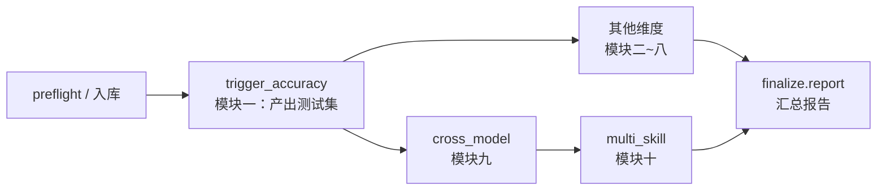
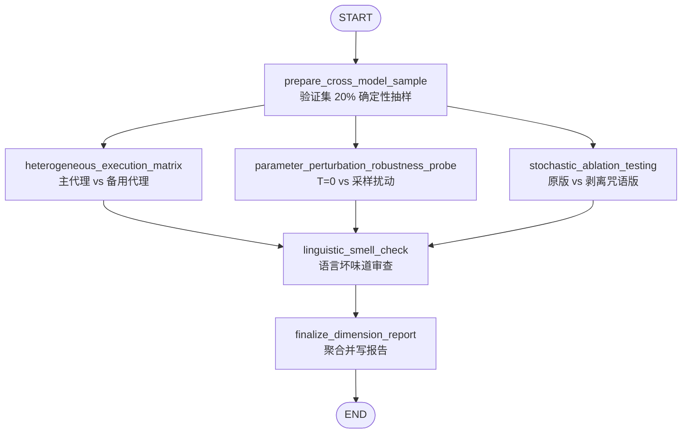
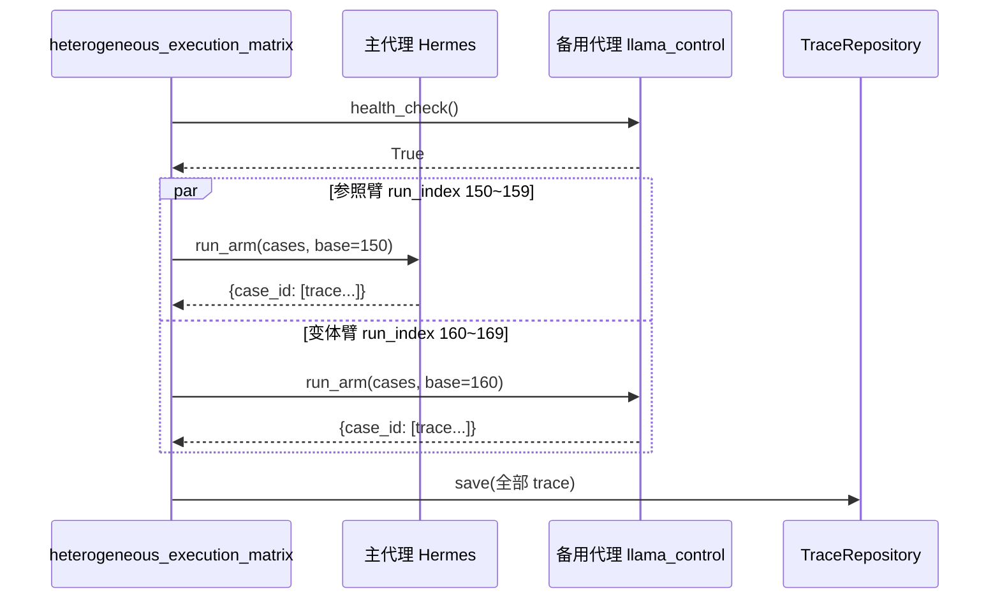
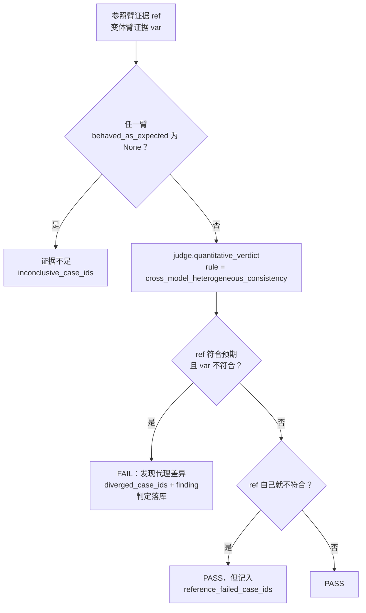
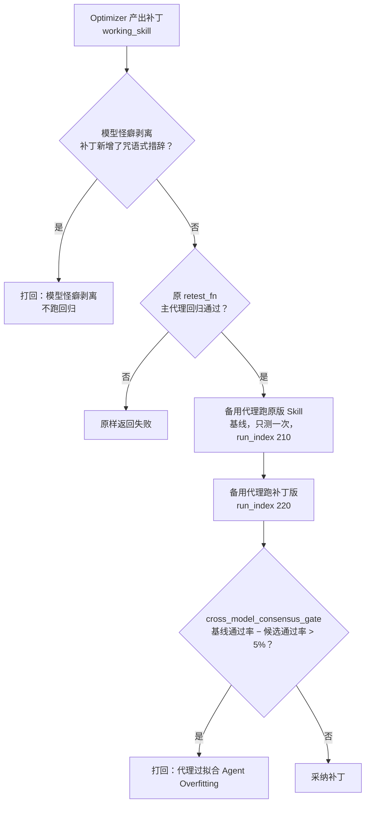
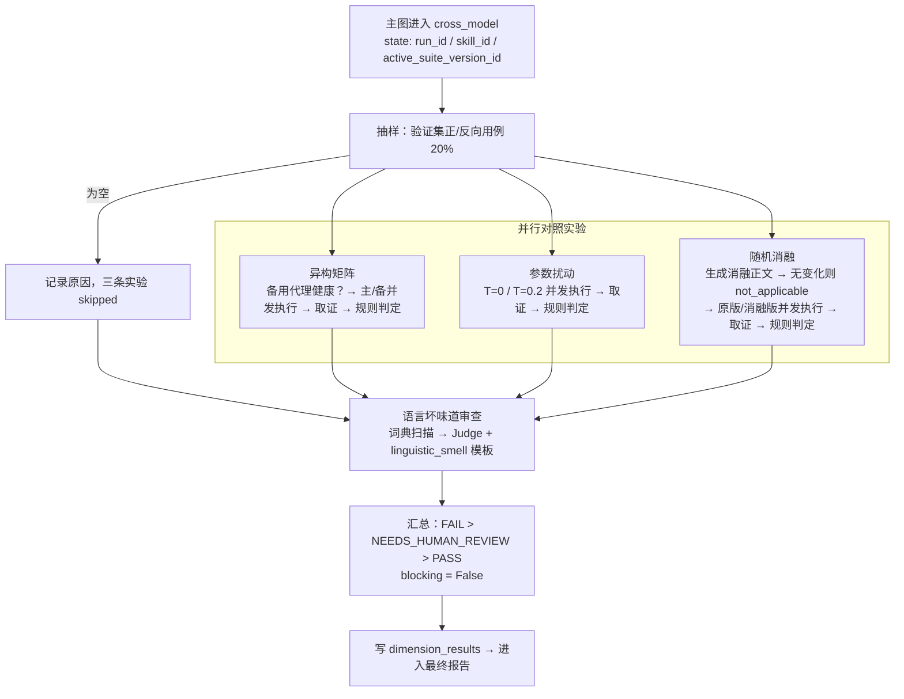

# cross_model 子图：跨模型泛化与代理绑架防范（模块九）

> 代码位置：`src/skill_evaluate/nodes/cross_model/`
> 关联组件：`executors/llama_backend.py`（备用代理）、`executors/comparison.py`（对照实验骨架）、
> `agents/analyzer/ablation_lexicon.py`（话术词典）、`agents/optimizer/consensus_gate.py`（补丁门控）
> 设计文档：`docs/dev/19_模块九_跨模型泛化与代理绑架防范机制.md`
> 接入文档：`docs/dev/interfaces/19_cross_model_generalization.md`

---

## 1. 一句话说清楚

**这个子图回答一个问题：这份 Skill 管用，是因为它写对了领域步骤，还是因为它恰好讨好了当前这个执行模型？**

整条评测流水线默认只用一个执行代理（Hermes）跑测试。Optimizer 不停地改 `SKILL.md`，改到测试通过为止。这里有个隐患：它可能学会了"对 Hermes 说好话"——加一句"请一步一步仔细思考"、"你是世界级专家"，或者把指令写成只有当前模型才吃得消的形状。测试是过了，但换一个模型、换一组采样参数，Skill 就失效了。

架构文档把这种现象叫**代理绑架（Agent Hijacking）**。cross_model 子图就是专门把它揪出来的维度。

---

## 2. 设计目的

| 目的 | 具体做法 |
|---|---|
| **资产保值**：Skill 不应和某个模型绑定，将来换底层模型要能无缝迁移 | 让同一批用例在**另一个架构不同的代理**（Llama 系列）上再跑一遍 |
| **识别脆弱指令**：只在贪心解码下成立的指令是过拟合 | 在主代理上对比 `temperature=0` 与 `temperature=0.2, top_p=0.9` |
| **识别"咒语依赖"**：好的 Skill 靠专有知识，不靠情绪化话术 | 按词典删掉"务必""仔细思考""你是专家"等措辞再跑一遍 |
| **约束文风**：客观技术文档式写法在模型间泛化更好 | 用 Mini Agent 做语言坏味道审查，全大写强调给降级警告 |
| **约束 Optimizer**：补丁不能靠讨好主代理过关 | 提供共识门控装饰器，供优化闭环按需叠加（见第 6 节） |
| **控制成本** | 只抽验证集 20%；每条臂默认只跑 1 次；无可剥离措辞时不起沙箱；**不阻断合并** |

最后一条很重要：架构文档自己承认这套机制"成本与迭代阻力激增"，所以这个维度采用**高可见度告警 + 不阻断**——它会在报告里明确写出问题，但是否因此拒绝合并由人决定。

---

## 3. 在整个评测流程中的位置



- **前置依赖**：模块一（trigger_accuracy）产出的 `active_suite_version_id`。本子图只**读**测试集，不生成、不修改。拿不到时会按 skill_id 查一次 active 版本；再没有就如实报告"无可用用例集"。
- **产出**：一条 `dimension_results` 记录（`dimension = cross_model_generalization`，`blocking = False`，`score = None`），以及落库的执行 Trace 和失败判定。
- **旁路贡献**：共识门控和模型怪癖拦截器不在这张图里运行，而是挂在**模块一 / 模块五的优化闭环**里，在"补丁要不要被采纳"这一刻起作用。

可以这么理解两者的分工：

- **子图 = 体检**：评估仓库里现在这份 Skill 的泛化健康度，出报告。
- **门控 = 门卫**：在 Optimizer 改 Skill 的过程中，不让"讨好主代理"的补丁混进来。

两者共用同一套执行骨架（`run_arm`）、同一套证据口径（`summarize_arm`）、同一份话术词典，保证"体检标准"和"门卫标准"一致。

---

## 4. 节点一览



三条对照实验**并行扇出**，互不依赖；`linguistic_smell_check` 用多源边汇合，**等三条都完成**才执行。三条支路共用一个沙箱并发信号量，所以并行不会把沙箱并发数翻三倍。

| # | 节点 | 作用 | 用哪个代理 | 产出（私有状态键） |
|---|---|---|---|---|
| 1 | `cross_model.prepare_cross_model_sample` | 从验证集的正/反向用例中确定性抽取 20% | — | `_xmodel_sample_case_ids`、`_xmodel_sample_note` |
| 2 | `cross_model.heterogeneous_execution_matrix` | 同一批用例同时交给主代理和异构备用代理，找出"主代理对、备用代理错"的用例 | 主 + 备 | `_xmodel_hetero_outcome` |
| 3 | `cross_model.parameter_perturbation_robustness_probe` | 主代理上对比贪心解码和微小采样扰动，找出"只在 T=0 下成立"的用例 | 主 | `_xmodel_perturbation_outcome` |
| 4 | `cross_model.stochastic_ablation_testing` | 按词典随机删掉情绪化措辞，找出"删了话术就不行"的用例 | 主 | `_xmodel_ablation_outcome` |
| 5 | `cross_model.linguistic_smell_check` | 经 Judge 调用 `linguistic_smell` 模板，把词典命中清单一并给模型复核 | Mini Agent | `_xmodel_linguistic_outcome` |
| 6 | `cross_model.finalize_dimension_report` | 汇总四项结论，决定维度状态并写报告 | — | 写 `dimension_results` |

### 4.1 prepare_cross_model_sample

- 只取 `VALIDATION` split 的 `POSITIVE` / `NEGATIVE` 用例。对抗用例、多技能用例、渐进式披露用例各有自己的判定语义，不能用"有没有加载 SKILL.md"来衡量。
- **可复现**：先按 `case_id` 排序，再用字符串种子 `skill-evaluate:cross-model-sample:{skill_id}` 抽样。同一个 Skill 每次抽到同一批，方便前后对比。（不用 `hash()`：它每个进程都不一样。）
- 验证集非空时至少抽 1 条。
- 验证集为空时**不补题**。一个非阻断维度不应该有权改变用例集；把原因写进 `_xmodel_sample_note`，最终报告状态为 `NEEDS_HUMAN_REVIEW`。

### 4.2 heterogeneous_execution_matrix

1. 抽样为空 → 标记 `skipped`。
2. 先对备用代理做 `health_check()`。不可用（例如没配 Llama endpoint）→ 标记 `skipped`，**不执行任何沙箱**，也不抛异常拖垮流水线。
3. 主代理（路由表 PLUGGABLE → 默认 Hermes）和备用代理（`llama_control`）**并发**跑同一批用例。
4. 逐条比较，产出 `[代理差异]` finding（比较方法见第 5 节）。

### 4.3 parameter_perturbation_robustness_probe

- 两条臂都在主代理上，只有 `sampling_overrides` 不同：
  - 基线：`{"temperature": 0.0}`
  - 扰动：`{"temperature": 0.2, "top_p": 0.9}`
- 产出 `[脆弱]` finding。
- ⚠️ 前提是执行模型真的接受采样参数。新一代 Claude 模型已经移除了 `temperature`/`top_p`，Hermes 若跑在这类模型上，两条臂其实是同一种解码，实验永远"没有发现"。所以 findings 第一行会写明下发的参数和这条前提。

### 4.4 stochastic_ablation_testing

1. 用 `ablate(body, seed, drop_probability=0.8)` 生成消融版正文：
   - 思维咒语、身份抬举、点名模型、情绪施压 → **删除**
   - 全大写强调（`NEVER` / `ALWAYS`）→ **降为小写**（`NEVER delete` 里的 never 是信息，删了会把禁令变成许可）
   - 连串感叹号 → 折叠成一个句号
   - 代码块和行内代码 → **完全不动**（代码是 Skill 的真实专有知识）
2. 消融后文本没有变化 → `not_applicable`，**不起沙箱**。这是正常结论，不影响维度状态。
3. 有变化 → 原版和消融版（`version_ref` 带 `+ablation`）各跑一遍并比较，产出 `[咒语依赖]` finding。

### 4.5 linguistic_smell_check

- 先用词典扫描正文，把命中清单渲染成 `lexicon_hits`，连同 `skill_md` 交给 `linguistic_smell` 模板。
- 走 `judge.judgmental_verdict(criticality=ROUTINE)`。本维度不阻断，没必要花三倍 Token 做共识投票。
- 词典**故意偏向误报**，最终是否算坏味道由模型对照原文判断。
- 两种特殊情况：
  - 请求被黄金基准盲测占用 → 记为 skipped，不写入本 Skill 的结论。
  - 返回的共识未达成（有人把重要度调成 CRITICAL 时才可能出现）→ 抛 `PipelineSuspended` 等人工仲裁。
- 另外统计全大写强调的数量，报告里给一条"降级警告"。

### 4.6 finalize_dimension_report

维度状态的优先级是 **FAIL > NEEDS_HUMAN_REVIEW > PASS**：

| 情形 | 状态 |
|---|---|
| 任一对照实验发现脆弱性，或语言坏味道审查 FAIL | **FAIL** |
| 抽样为空 / 某条实验被跳过 / 有用例证据不足 / 审查被盲测占用 / 结果键缺失 | **NEEDS_HUMAN_REVIEW** |
| 其余（包括消融 `not_applicable`） | **PASS** |

固定输出 `blocking = False`、`score = None`。三条性质不同的实验加一项文本审查，硬凑一个分数没有意义。

---

## 5. 主备执行差异是如何对比的（核心）

三条对照实验的比较方法完全相同，只是"两条臂"不同：

| 实验 | 参照臂（reference） | 变体臂（variant） |
|---|---|---|
| 异构矩阵 | 主代理（Hermes） | 备用代理（Llama） |
| 参数扰动 | 主代理 + `T=0` | 主代理 + `T=0.2, top_p=0.9` |
| 随机消融 | 主代理 + 原版 SKILL.md | 主代理 + 消融版 SKILL.md |

下面以**主备对比**为例说明完整链路。

### 5.1 执行：两条臂并发、号段隔离



- **并发**跑两条臂，而不是先跑完一边再跑另一边。间隔越久，外部环境（模型版本、限流）漂移越大，对照里就混进了与被测变量无关的差异。
- **run_index 号段隔离**：`execution_traces` 的唯一键是 `(case_id, run_index)`。主代理用 150 段、备用代理用 160 段，互不覆盖，也不覆盖模块一（0~2）、模块三（100~110）、模块五（120~141）的 Trace。每段宽 10，所以 `runs_per_arm` 最多可以设到 10。
- **后端透明**：`llama_control` 返回的结果体和 Hermes Hook Payload 结构相同，经**同一个** `map_hermes_payload_to_trace()` 转成 Trace。两条臂的 Trace 生成口径必须一致，否则"备用代理没触发"可能只是两套映射代码写法不同。

### 5.2 取证：把 Trace 折算成"是否符合预期"

对每条用例、每条臂调用 `summarize_arm(traces, category)`：

```
① 去掉失败态 Trace
   末尾动作是 internal_error / sandbox_timeout 的 Trace 不算证据
        ↓
② 对剩下的有效 Trace，判断触发行为是否符合预期
   POSITIVE 用例：loaded_skill_md == True  才算符合
   NEGATIVE 用例：loaded_skill_md == False 才算符合
        ↓
③ 得到 ArmEvidence(expected_count, conclusive_count, total_count)
   rate = expected / conclusive
   behaved_as_expected = rate >= 0.5；没有有效执行时为 None
```

有两个关键点，都是为了**不制造假结论**：

1. **不直接用 `loaded_skill_md` 当"通过"**。反向（近脱靶）用例不加载才是对的。如果直接比较，备用代理正确地没有误触发，会被读成"备用代理没通过"。
2. **失败态 Trace 不是证据**。沙箱超时时，后端返回 `loaded_skill_md=False` 的保守 Trace。不剔除的话，正向用例会凭空多出一条"代理差异"，反向用例会凭空多出一次"通过"。

### 5.3 判定：经 Judge 的量化规则



规则真值表：

| 参照臂 | 变体臂 | 结论 | 含义 |
|---|---|---|---|
| ✅ 符合 | ✅ 符合 | PASS | 两边一致 |
| ✅ 符合 | ❌ 不符合 | **FAIL** | 被绑架：只在主代理上成立 |
| ❌ 不符合 | 任意 | PASS（单独列出） | 主代理自己就不行，这是模块一的问题，不在本维度重复扣分 |
| 无有效证据 | 任意 | 证据不足 | 交给人确认 |

实现上的几条约定：

- **判定一律经 `JudgeAgent.quantitative_verdict()`**，不在节点里手写 if/else（项目铁律：所有通过/失败都经 Judge）。
- **只归档 FAIL 判定**，`subject_id` 带前缀：`xmodel_hetero:` / `xmodel_perturb:` / `xmodel_ablation:`。
- 三条实验共用一份判定逻辑，但注册成三个规则名：
  - `cross_model_heterogeneous_consistency`
  - `cross_model_perturbation_robustness`
  - `cross_model_ablation_robustness`

  这样报告里 `model = rule:<name>` 能一眼看出是哪类问题。
- 规则输入只传四个计数，不传整串 Trace（输入会被原样写进 reasoning）。

### 5.4 备用代理 `llama_control` 如何等待结果

| 模式 | 流程 | 适用场景 |
|---|---|---|
| `poll`（默认） | 提交任务 → 进程内每 5s 查询状态 → 完成即映射；超过 `wall_clock_timeout_s + 15s` 返回 `sandbox_timeout` 失败态 | 只提供查询接口的托管方案；不依赖图上下文，门控里也能直接用 |
| `callback` | 提交时带回调地址 → 写 `pending_hooks` → `suspend_and_wait()` 挂起 → 运行时回调 `/hooks/llama_control/...`（HMAC 验签）→ 落库并唤醒 | 长任务；与 Hermes 共用同一套挂起/唤醒框架 |

未配置 endpoint 时使用 `UnconfiguredLlamaControlClient`：提交直接报错，健康检查返回 False。它**绝不伪造成功**，于是异构矩阵会被跳过，并在报告里写明原因。

---

## 6. 共识门控：把同样的对比用在补丁审核上

子图评估的是"现在这份 Skill"。而防止绑架最关键的时刻，是 **Optimizer 提出补丁、决定采不采纳的那一刻**。`consensus_gate.py` 提供两个 `retest_fn` 装饰器，给模块一 / 模块五的优化闭环按需叠加：

```python
retest_fn = with_quirk_stripping_gate(retest_fn, baseline_skill=skill)          # 静态，零成本，先跑
retest_fn = with_consensus_gate(retest_fn, train_cases, run_id=run_id,
                                baseline_skill=skill)                           # 动态，最贵，最后跑
patch = await OptimizationLoop().run(run_id, ctx, retest_fn, optimizer)
```



- **Pareto 条件**：主代理上通过回归（由原 `retest_fn` 保证），**并且**备用代理没有显著退化。
- **按相对基线算退化**：备用代理的降幅不超过 5% 就放行（架构文档说的"权重容忍度"）。如果原版在备用代理上本来就只有 60%，补丁后仍是 60%，不算退化。不传 `baseline_skill` 时退回绝对口径：候选通过率 < 95% 即打回。
- **只能用训练集用例**：门控结果决定补丁取舍，本身就是优化信号；用验证集会让验证集间接参与优化。
- **fail closed**：备用代理上一条有效证据都没有时打回。闭环重试耗尽后会挂起到人工审批，人可以明确采纳。
- **静态拦截**只打回新增的思维咒语、身份抬举、点名模型、情绪施压四类措辞。新增的 `NEVER` 这类强调只告警，因为安全补丁写 "NEVER pass user input to a shell" 是正当的。
- 调用方用 `is_agent_overfitting(result)` / `is_model_quirk_rejection(result)` 区分打回原因。

门控永远**只收紧、不放宽**：原本失败的补丁，加了门控也不会变成通过。

---

## 7. 主要业务流程（端到端）



按时间顺序：

1. **进入维度**：主图把 `run_id`、`skill_id`、`skill_version_ref` 以及模块一产出的 `active_suite_version_id` 传进来。
2. **抽样**：从 active 用例集取正/反向用例，筛出验证集，确定性抽 20%，只把 case_id 写入状态。
3. **三条对照实验并行**：每条都是"两臂并发执行 → Trace 落库 → 逐用例取证 → Judge 量化判定 → 只归档 FAIL"。各自把 `ProbeOutcome`（已比较 / 脆弱 / 证据不足 / 参照臂自身失败 / findings / verdict_ids）写入自己的状态键。
4. **语言坏味道审查**：词典初筛 + 模型复核，结论写入 `_xmodel_linguistic_outcome`。
5. **汇总**：拼 findings（抽样说明、每条实验的统计与问题用例、坏味道结论、大写强调降级警告），按优先级定状态，写入 `dimension_results`。
6. **报告**：`ReportGenerator.build()` 汇总各维度。本维度 `blocking=False`，即使 FAIL 也不单独卡住合并，但会在报告里清楚标出。
7. **（旁路）优化闭环**：模块一 / 模块五若启用了门控，每一轮补丁都会先过静态拦截，再过主代理回归，最后过备用代理的共识判定。

---

## 8. 一个具体例子

某 Skill 正文里有这样一句："你是一位世界级的数据清洗专家，请务必仔细思考"。抽样到 3 条验证用例：`pos-1`、`pos-2`（正向），`neg-1`（反向）。

| 实验 | 用例 | 参照臂 | 变体臂 | 结论 |
|---|---|---|---|---|
| 异构矩阵 | pos-1 | Hermes 加载 ✅ | Llama 加载 ✅ | PASS |
| 异构矩阵 | pos-2 | Hermes 加载 ✅ | Llama 未加载 ❌ | **FAIL** `[代理差异] pos-2` |
| 异构矩阵 | neg-1 | Hermes 未加载 ✅ | Llama 未加载 ✅ | PASS（没加载才是对的） |
| 参数扰动 | pos-1 | T=0 加载 ✅ | T=0.2 沙箱超时 | 证据不足 |
| 随机消融 | pos-2 | 原版加载 ✅ | 删掉"世界级专家/务必/仔细思考"后未加载 ❌ | **FAIL** `[咒语依赖] pos-2` |
| 坏味道 | — | 词典命中 3 处 | 模型确认属于咒语式话术 | **FAIL** |

最终：维度状态 **FAIL**，`blocking=False`。报告里能看到：pos-2 同时暴露了"代理差异"和"咒语依赖"，这很可能是同一个原因——它的触发依赖话术而不是清晰的场景描述。另外 pos-1 在扰动实验里证据不足，需要人看一眼。

---

## 9. 关键配置

| 环境变量 | 默认 | 作用 |
|---|---|---|
| `SKILLEVAL_CROSS_MODEL_SAMPLE_RATIO` | 0.2 | 验证集抽样比例 |
| `SKILLEVAL_CROSS_MODEL_SECONDARY_BACKEND` | `llama_control` | 备用代理后端名（不能与主后端相同） |
| `SKILLEVAL_CROSS_MODEL_RUNS_PER_ARM` | 1 | 每条臂每条用例跑几次（1~10） |
| `SKILLEVAL_CROSS_MODEL_PERTURBATION_*_OVERRIDES` | `T=0` / `T=0.2,top_p=0.9` | 扰动实验参数 |
| `SKILLEVAL_CROSS_MODEL_ABLATION_DROP_PROBABILITY` | 0.8 | 每处咒语被删除的概率 |
| `SKILLEVAL_CROSS_MODEL_CONSENSUS_TOLERANCE` | 0.05 | 门控允许的备用代理降幅 |
| `SKILLEVAL_EXECUTOR_LLAMA_CONTROL_ENDPOINT` | 空 | 备用代理运行时地址；为空时异构矩阵会被跳过 |
| `SKILLEVAL_EXECUTOR_LLAMA_CONTROL_WAIT_MODE` | `poll` | `poll` / `callback` |

装配期有两条硬校验，配错会直接 `ConfigurationError`：

1. 本维度的路由必须是 PLUGGABLE。Mini 后端的 `loaded_skill_md` 恒为 True，任何对照都会"完全一致"。
2. 主备后端不能是同一个。否则就是拿一个模型和自己比。

---

## 10. 设计取舍速查

| 取舍 | 选择 | 理由 |
|---|---|---|
| 是否阻断合并 | 不阻断 | 成本高、共识难达成；给人高可见度信息，由人决定 |
| 备用代理不可用 | 跳过并 NEEDS_HUMAN_REVIEW | 非阻断维度的外部依赖不应拖垮流水线，也不能静默 PASS |
| 验证集不足 | 不补题，如实报告 | 非阻断维度无权改变用例集 |
| 比较口径 | 触发行为是否符合类别预期 | 反向用例方向相反 |
| 超时 Trace | 不算证据 | 否则会凭空制造差异或通过 |
| 判定方式 | 注册量化规则经 Judge | 全项目统一的可信度机制与报告口径 |
| 门控退化口径 | 相对基线降幅 ≤ 5% | 绝对口径会让 Optimizer 在弱基线 Skill 上永远碰壁 |
| 词典 | 一份，三处消费 | 防止"静态审查说没问题、消融却发现依赖"的自相矛盾 |
| 消融对大写强调 | 降为小写而不删除 | 删掉 NEVER 会反转语义 |
| 代码块 | 不参与消融/扫描 | 代码是真实专有知识 |
