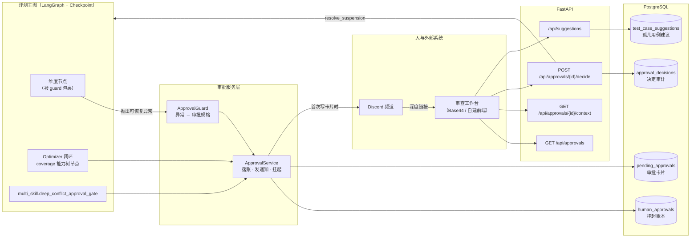
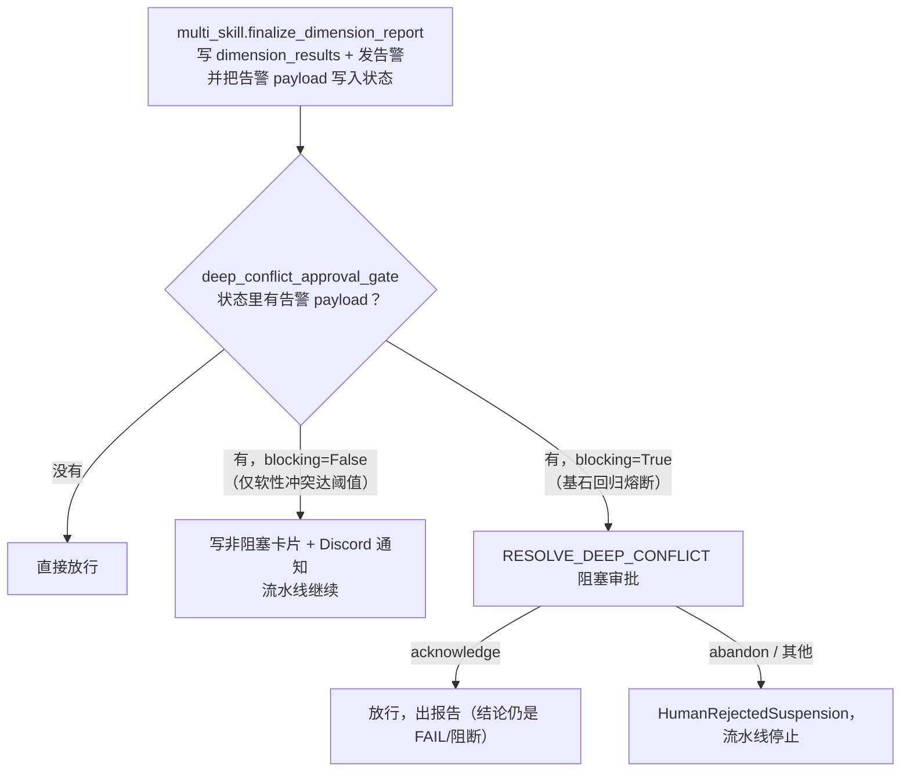
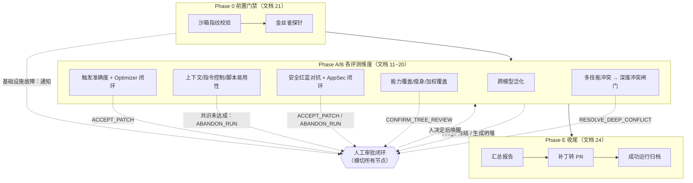
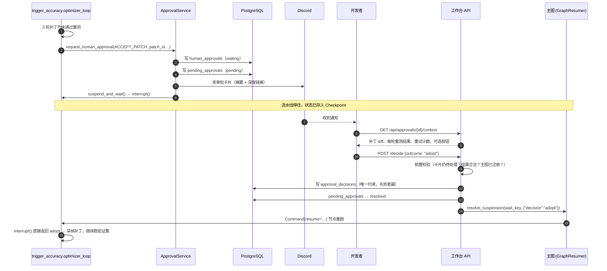
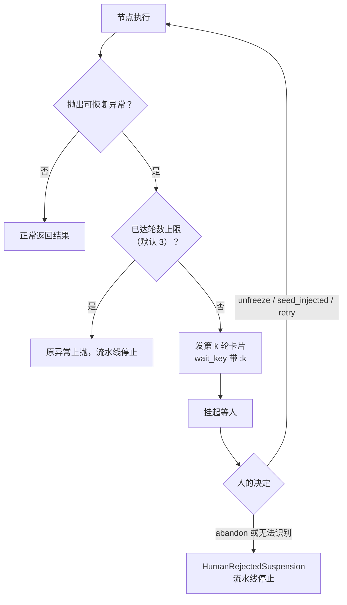
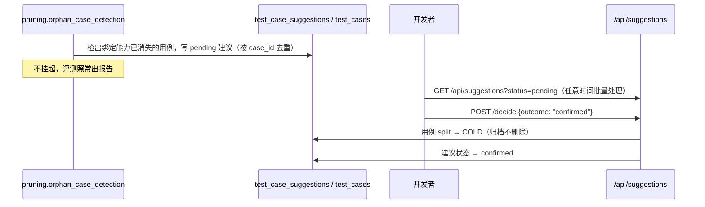
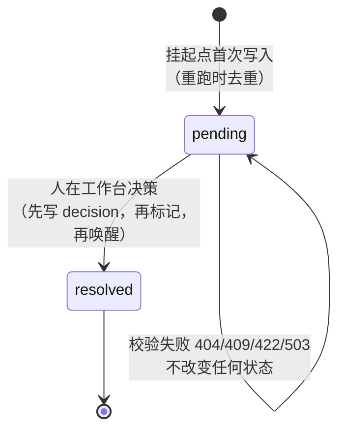

# 人工审批闭环：它是什么、做什么、为什么这样设计

> 对应开发文档：`docs/dev/22_容错机制与人工审批闭环.md`
> 对应接入文档：`docs/dev/interfaces/22_human_approval_workbench.md`
> 本文面向想快速理解"评测流水线在什么时候、以什么方式把决定权交给人"的读者。

---

## 1. 一句话概括

**人工审批闭环不是一张独立的子图，而是覆盖在整个评测主图之上的"刹车 + 呼叫 + 恢复"机制。**

评测流水线跑到某个节点时，如果遇到**机器不该替人做主**的情况（补丁反复修不好、裁判被证明不可靠、测试题生成原地打转、多技能冲突危及核心 Skill……），它会：

1. 在原地**停住**（LangGraph 动态 `interrupt()`，状态存进 Checkpoint）；
2. 写一张**审批卡片**到数据库，并往 Discord **发通知**；
3. 等人在**审查工作台**上看完证据、点下决定；
4. 把决定**翻译**成节点能读懂的指令，**唤醒**流水线从停住的地方继续（或者按人的意愿终止）。

---

## 2. 为什么需要它：它要解决的问题

在文档 22 之前，项目里已经散落着 6 处"需要人介入"的地方，但各自为政：

| 场景 | 来源模块 | 以前的状态 |
|---|---|---|
| Optimizer 连续 3 轮补丁都没通过重测 | 09 | 自己写账本、自己挂起，回传格式自定 |
| Judge 在黄金基准盲测中失误率超标被冻结 | 08 | 只打一条日志，流水线直接抛异常结束 |
| 能力树拆出来的能力项太多，需要人确认粒度 | 16 | 自己写账本、自己挂起，回传格式自定 |
| 多技能并发时引入新 Skill 导致核心 Skill 退化 | 20 | 只发告警，没人真正拦下来 |
| Generator 连续多次生成"坍塌"的雷同题目 | 21 | 抛异常 + 告警，没有恢复路径 |
| 孤儿用例（绑定的能力已不存在）建议淘汰 | 17 | 建议写进表里，没有任何地方处理 |

问题有三：

- **人看不到**：有的只打日志，有的直接让流水线崩掉，没有统一的"待办列表"。
- **人管不了**：即使看到了，也没有标准接口去"批准/拒绝"，更没办法让流水线接着跑。
- **前端没法做**：每种场景的数据形状、回传格式都不同，工作台每新增一种场景就要改一次。

**设计目的**就是把这 6 处（实现时又补了 2 处）收口到**同一套**数据模型、同一个挂起入口、同一组 API 上。

---

## 3. 整体架构

四层各司其职：

| 层 | 组件 | 职责 |
|---|---|---|
| **触发层** | `ApprovalGuard`、Optimizer/coverage 挂起点、深度冲突闸门节点 | 判断"这里需要人"，决定发哪种卡片 |
| **服务层** | `ApprovalService` | 统一的挂起入口：写账本、写卡片、发通知、真正挂起 |
| **通知层** | `DiscordApprovalNotifier` / `DiscordAlertDispatcher` | 让人**知道**有事要处理（只通知，不决策） |
| **决策层** | 审查工作台 API | 让人**看证据、做决定**，并把决定变成流水线的恢复指令 |

---

## 4. 它由哪些"节点/组件"构成，各自作用

严格说，文档 22 只往图里加了**一个**新节点，其余都是作用在节点上的机制。

### 4.1 `ApprovalGuard`（节点级守卫）——覆盖所有维度节点

**作用**：把"会让流水线停下的异常"转换成审批卡片，而不是让整条流水线崩掉。

主图装配时用 `ApprovalGuardedBuilder(builder)` 代理 `StateGraph`，每个 `add_node` 自动包一层 guard，各维度的装配代码一行不用改。

| 捕获到的异常 | 转成什么 | 人选"继续"后 |
|---|---|---|
| `JudgeFrozenError`（裁判被冻结） | `UNFREEZE_JUDGE` 阻塞卡片 | API 先解冻 Judge，再重跑该节点 |
| `GenerationCollapseError` 且已达连续上限 | `INJECT_NEW_SEED` 阻塞卡片 | 人补完种子库后重跑该节点 |
| 其余 `PipelineSuspended`（如三副本共识未达成） | `ABANDON_RUN` 阻塞卡片 | `retry` 重跑该节点 |
| `InfrastructureEnvironmentError`（沙箱指纹/金丝雀失败） | `ABANDON_RUN` **非阻塞**通知卡片 | 不恢复，异常照常抛出，修好环境重跑整条流水线 |
| `HumanRejectedSuspension`（人已经说过"不"） | 不发卡片 | 原样抛出，流水线停止 |

**为什么放在节点边界**：Judge 冻结、生成坍塌发生在 Agent 内部，那里不一定处于图执行上下文，也拿不到 `run_id`；而每个节点手写 try/except 必然会漏。节点边界是唯一同时"在图里"且"知道是哪次运行"的位置。

### 4.2 Optimizer 闭环挂起点（`OptimizationLoop._suspend`）

**作用**：自动优化连续 N 轮（默认 3）都没修好时，不直接判负，而是发 `ACCEPT_PATCH` 卡片，让人看候选补丁的 diff 和每轮重测结果，决定"采纳最后一个补丁"还是"放弃"。

服务于模块一（description 优化）、模块三（指令控制）、模块五（AppSec 安全补丁）。

### 4.3 能力树规模确认点（`coverage.extract_capability_tree`）

**作用**：Analyzer 拆出的能力项超过阈值（默认 20）时，发 `CONFIRM_TREE_REVIEW` 卡片，让人判断"是不是把执行步骤误拆成了能力"。粒度不对的话，后面每个覆盖率数字都会失真，所以必须等人确认。

### 4.4 `multi_skill.deep_conflict_approval_gate`（新增节点）

**作用**：模块十（多技能并发冲突）的新终点，读取收尾节点写进状态的告警 payload，按是否阻断分流：

**为什么单独做成节点**：告警发送被 `dispatch_alert` 的 try/except 包着，在里面挂起会被当成通道故障吞掉；而把挂起放在独立的轻量节点里，恢复时只重跑这个闸门，不会重写结果、重发告警。

### 4.5 `ApprovalService`（统一挂起入口）

**作用**：所有阻塞审批的唯一出口，按固定顺序做四件事：

1. 写 `human_approvals`（挂起账本，唤醒时靠它做幂等判断）；
2. 写 `pending_approvals`（工作台看到的卡片，`approval_id` 由 `wait_key` 确定性派生）；
3. **仅当卡片是首次插入时**发 Discord 通知（节点恢复重跑时不重复打扰人）；
4. 调用 `suspend_and_wait()` 真正挂起，返回值就是人给出的决定。

同时统一了 `thread_id` 口径为 `skill_id:run_id`，保证人批准后唤醒的是正确的那次运行。

### 4.6 通知通道（Discord）

**作用**：只负责"让人知道"，卡片上是摘要 + 工作台深度链接，**没有批准按钮**。

- 未配置 Webhook 时自动退回"只写结构化日志"，审批流程本身不受影响；
- 同一个 Webhook 还承载三类告警：`judge_frozen`、`deep_multi_skill_conflict`、`generation_collapse_persistent`；
- 所有消息禁用 `@` 提及，防止 SKILL.md 里的 `@everyone` 被转发出去。

### 4.7 审查工作台 API

**作用**：人与流水线之间唯一的决策通道。

| 端点 | 作用 |
|---|---|
| `GET /api/approvals?status=pending` | 待办卡片列表 |
| `GET /api/approvals/{id}/context` | 按卡片类型展开证据（补丁 diff、Judge 失误记录、能力树、单跑 vs 并发双路 Trace、坍塌事件……），并返回可选按钮 |
| `POST /api/approvals/{id}/decide` | 提交决定 → 翻译成恢复指令 → 唤醒流水线 |
| `GET/POST /api/suggestions...` | 孤儿用例建议队列，确认后把用例归档为 `COLD` |
| `POST /hooks/approval/{run_id}/{node}` | 带 HMAC 签名的机器对机器回调，逻辑与 decide 相同 |

---

## 5. 在整个评测流程中的位置

它在流程中扮演三个角色：

1. **安全阀**：机器没把握的结论不进报告。被冻结的裁判、没达成共识的判决、没被批准的补丁，都不会被悄悄降级成"通过"或"失败"。
2. **续航器**：以前遇到这些情况流水线只能崩掉重来；现在停在原地，人处理完从断点继续，已经跑完的沙箱执行和 LLM 调用不白费。
3. **数据生命周期的最终把关人**：孤儿用例的淘汰、测试集的归档，这类不可轻易撤回的操作只能由人在工作台上确认，流水线里没有任何自动执行路径。

---

## 6. 主要业务流程

### 6.1 流程一：阻塞式审批（最核心的一条）

以"Optimizer 连续 3 轮修不好补丁"为例：

关键点：

- **先校验、后写状态**：主图没注册唤醒器时直接返回 503 且不写任何东西，人等主图就绪后可以再点一次；否则账本改了、流水线却永远醒不过来。
- **并发决策由数据库裁决**：两个人同时点"采纳"和"放弃"，只有先写进 `approval_decisions` 的生效，后到者得到 409。
- **恢复 = 节点整体重跑**：这是 LangGraph 动态中断的语义，所以挂起前的写入都按唯一键去重，卡片和通知都不会重复。

### 6.2 流程二：可重试的审批（guard 的循环）

以"Judge 被冻结"或"共识未达成"为例：

- 人选"解冻"时，**API 先执行解冻**再唤醒，所以节点重跑时 Judge 已恢复可用，直接成功；
- 如果问题依旧，前面每一轮的中断会直接返回历史决定，本轮发一张**新卡片**，工作台上看到的是独立的第 2、第 3 张卡；
- 默认"没被明确批准就算放弃"：payload 形状对不上时一律按拒绝处理，绝不把含糊的回复当成批准。

### 6.3 流程三：非阻塞通知

适用于"问题值得人知道，但流水线不等人也能产出有意义的结果"：

- 多技能**软性**冲突达到告警阈值（没有基石熔断）；
- 前置门禁的基础设施故障（修好环境重跑整条流水线即可，没有"批准继续"的语义）。

处理方式：只写一张 `blocking=false` 的卡片 + 发 Discord 通知，**不写账本、不挂起**。人在工作台上只能点"已知悉"，不会出现一个误以为能叫停评测的"放弃"按钮。

### 6.4 流程四：孤儿用例建议队列（独立于挂起机制）

归档而不删除：历史 Trace、判定记录仍能回查，旧版本测试集仍可复现；而按训练/验证集取题的维度从此不再看到它。

---

## 7. 统一的决策模型

### 7.1 决策类型与可选结果

| decision_type | 含义 | "继续"选项 | "否定"选项 |
|---|---|---|---|
| `accept_patch` | 是否采纳候选补丁 | `adopt` | `abandon` |
| `unfreeze_judge` | 是否解冻裁判 | `unfreeze` | `abandon` |
| `confirm_tree_review` | 能力树粒度是否正确 | `confirm` | `reject` |
| `inject_new_seed` | 是否已补充种子 | `seed_injected` | `abandon` |
| `abandon_run` | 重试节点还是放弃本次评测 | `retry` | `abandon` |
| `resolve_deep_conflict` | 是否放行多技能冲突 | `acknowledge` | `abandon` |
| `confirm_orphan_retirement` | 是否淘汰孤儿用例（走建议 API） | `confirmed` | `rejected` |
| 任意类型的**非阻塞**卡片 | — | `acknowledge` | — |

设计原则：**每一种阻塞卡片都有否定选项**。人必须始终有权说"不"，否则审批就退化成了一个只能点"继续"的确认框。

### 7.2 三张表的分工

| 表 | 层次 | 记录什么 | 谁写 |
|---|---|---|---|
| `human_approvals` | 挂起账本 | wait_key、thread_id、waiting → resolved | 挂起时 ApprovalService / 唤醒时 resolve_suspension |
| `pending_approvals` | 业务卡片 | 决策类型、摘要、证据引用、是否阻塞、状态 | 挂起时 ApprovalService / 决策时 API |
| `approval_decisions` | 审计 | 谁、何时、选了什么、备注（一张卡一条） | 决策 API |

保留 `human_approvals` 而不是替换它，是因为它已经是 Hermes 沙箱回调、Llama 回调共用的唤醒账本，替换只省一张表，却要返工已验证的唤醒路径。

### 7.3 卡片状态机

---

## 8. 关键设计取舍

| 取舍 | 选择 | 理由 |
|---|---|---|
| Discord 做决策还是只做通知 | **只做通知** | 补丁 diff、双路 Trace 并排比对在聊天软件里既难看又难维护；消息丢了也不丢审批，卡片本体在库里 |
| 什么时候阻塞、什么时候只通知 | **看"不等人能否产出有意义的结果"，而不是看"问题是否重要"** | 深度冲突再重要，只要不影响其他维度的结论，就不该拖慢整体评测 |
| 在哪里接住冻结/坍塌异常 | **节点边界统一接住** | Agent 内部没有图上下文和 run_id；逐节点手写 try/except 必漏 |
| 恢复指令的形状 | **统一为 `{"decision": outcome, ...}`** | 挂起点只读一个键；既有的补丁/能力树解析函数本来就兼容 |
| 模糊的回复怎么处理 | **一律按拒绝处理** | 没被明确批准的补丁、能力树，不该因为格式对不上就被当成批准 |
| 淘汰用例是删除还是归档 | **归档为 COLD** | 保留证据链与历史可复现性 |
| 用户鉴权 | **不在本项目实现** | 部署在内网 / SSO 网关之后；机器调用走 HMAC 签名回调 |

---

## 9. 失败与边界情况

| 情况 | 系统行为 |
|---|---|
| Discord Webhook 故障 | 记日志，不影响挂起；卡片已在库里，工作台照常可见 |
| 未配置 Webhook | 自动退回日志通道，审批流程完整可用 |
| 主图唤醒器未注册时有人点决策 | 返回 503，不写任何状态，稍后可重试 |
| 两人同时决策同一张卡 | 数据库唯一约束裁决，先到者生效，后到者 409 |
| 节点恢复后问题依旧 | 发下一轮新卡片，超过轮数上限后原异常上抛 |
| 状态里缺 `run_id` | guard 不挂起，原样抛出（无法定位是哪次运行） |
| 证据展开时某个查询失败 | 该项记入 `expansion_errors`，其余证据照常返回 |
| 唤醒后图在继续执行中报错 | 返回 500；卡片与决定已落库，按 thread_id 排查运行本身 |
| 辅助补题路径（覆盖率补盲等）遇到生成坍塌 | 不升级为审批，维度照常出结论，人通过告警知悉 |

---

## 10. 与后续模块的衔接（文档 24 需要做的事）

1. 主图各维度节点通过 `ApprovalGuardedBuilder` 装配，否则冻结/共识异常会直接让流水线崩掉，工作台上没有卡片；
2. 编译主图后调用 `register_graph_resumer(...)`，否则决策 API 对阻塞卡片返回 503；
3. 主图状态 schema 并入模块十的两个新私有键，终点使用 `multi_skill.TERMINAL_NODE`；
4. 主图 `thread_id` 统一使用 `skill_id:run_id`；
5. CLI `run` 入口调用 `configure_notification_channels()` 注册 Discord 通道；
6. 若单次唤醒后的评测耗时超过网关超时，把唤醒改为投递后台任务（接口不变）。
