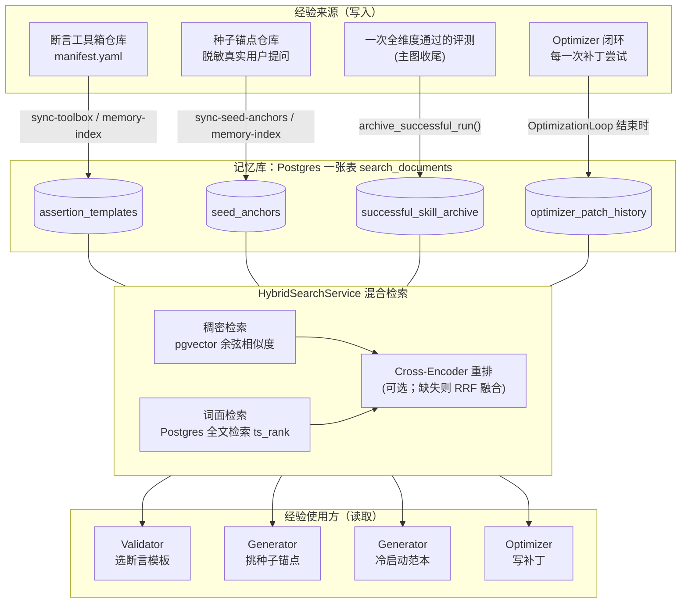
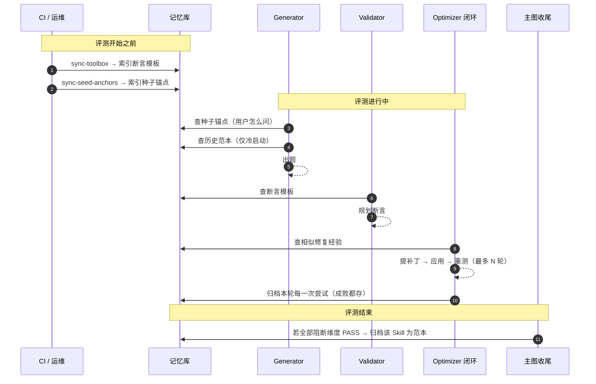
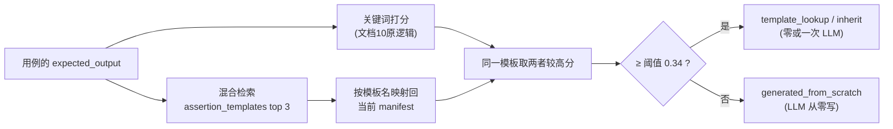
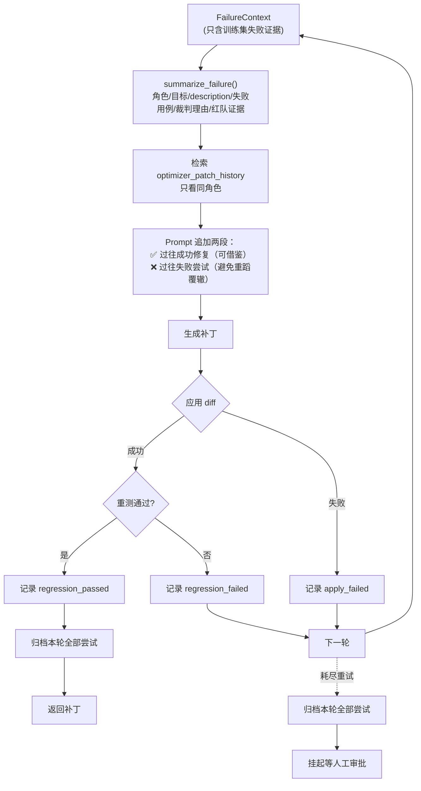
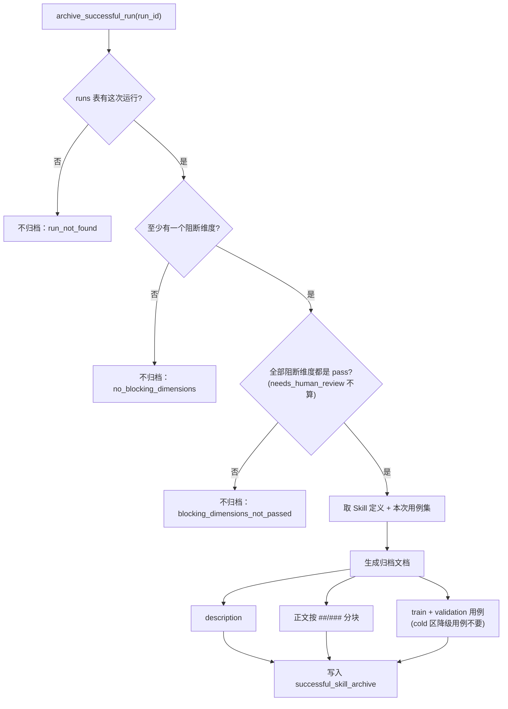
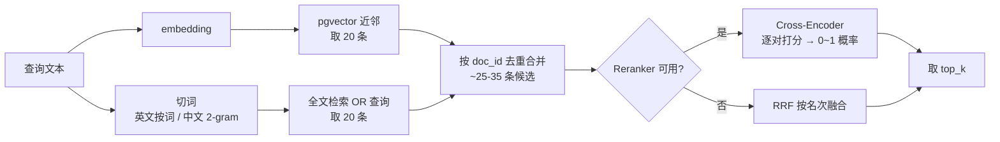
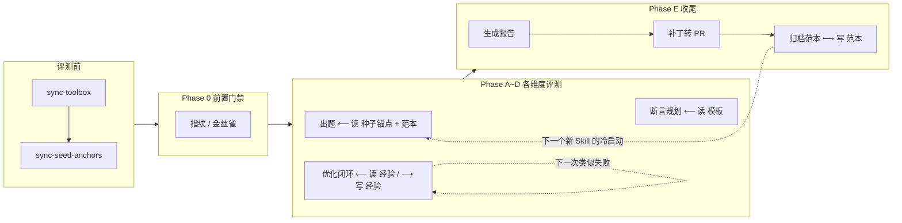

# 长时记忆与数据飞轮：它是什么、做什么、为什么这样设计

> 对应开发文档：`docs/dev/23_长时记忆与数据飞轮.md`
> 对应接入文档：`docs/dev/interfaces/23_memory_and_data_flywheel.md`
> 代码位置：`src/skill_evaluate/memory/`（外加三处嵌入点：Validator、Generator、Optimizer）
> 本文面向想快速理解"评测系统怎么从过去的评测里学到东西、并用在下一次评测上"的读者。

---

## 1. 一句话概括

**长时记忆不是一张 LangGraph 子图，而是一层"让评测系统有经验"的检索服务。它嵌在几个已有 Agent 内部，在它们调用大模型之前，先去查一下"以前有没有见过类似的情况"。**

它做两件事，缺一不可：

1. **记下来**（写入）：评测过程中产生的有价值的东西——全维度通过的优质 Skill 及其测试用例、Optimizer 每一次修补丁的成败——写进一个统一的记忆库。
2. **找出来**（读取）：下一次 Generator 出题、Validator 选断言模板、Optimizer 写补丁时，从记忆库里检索最相关的几条，作为 Few-shot 示例塞进 Prompt。

"写入 → 下次读取 → 产出更好 → 再写入"，这个循环就是**数据飞轮**：系统跑得越多，积累的经验越多，后面的产出越稳定。

> 为什么这里要特意说"不是一张 graph"：前面几份 Hdocs 讲的 pruning、weighted_coverage、cross_model 都是有自己节点和边的子图，负责评测**某一个维度**。长时记忆不评测任何维度、不产出任何分数，它是**横切**在多个 Agent 里的基础能力。它唯一在主图上占一个节点位置的地方，是流水线收尾时的"归档"（见第 5.5 节，这个节点由文档 24 接入）。

---

## 2. 为什么需要它：它要解决的问题

在文档 23 之前，系统里的每一个 Agent 都是 **Zero-shot** 工作的：

| Agent | 每次都在做的事 | 问题 |
|---|---|---|
| Generator（出题） | 拿到一份没见过的 Skill，凭 Prompt 里的规则出 18 道题 | 冷门领域的 Skill，模型不知道"好题"长什么样，质量忽高忽低 |
| Optimizer（修补丁） | 看到失败证据，写一个 diff | 上周另一个 Skill 遇到过一模一样的失败、试过三种改法两种没用——它完全不知道，于是再试一遍没用的那两种 |
| Validator（选断言模板） | 用关键词去工具箱里匹配模板 | 用例写"确认导出的 PDF 里有合同编号"，模板的关键词是 `pdfplumber`，词面对不上就命不中，只好花一次 LLM 调用从零写脚本 |
| Generator（种子锚点） | 用单一 embedding 相似度挑真实用户提问 | 语义相近能找到，但 `pdfplumber` 这类专有名词的精确命中很弱 |

架构文档对此的判断是：**让系统从"盲目推测"进化到"经验驱动"**。代价是多一套检索基础设施要维护，以及要认真设计文本怎么切块。

---

## 3. 整体架构



三个层次各自的职责：

- **存储层**：只有一张表 `search_documents`，同一行里既存 1536 维向量（给稠密检索用），也存全文检索索引（给词面检索用），用 `collection` 列区分四个逻辑集合。不引入独立向量库或 Elasticsearch——与项目"一个 Postgres 装下一切"的决策保持一致。
- **检索层**：`HybridSearchService` 是记忆库**唯一**的读写入口。四类使用方都走它，不各自实现一套"差不多的相似度"。
- **使用层**：Validator、Generator、Optimizer 在各自原本的流程里多加一步"先查记忆"。

---

## 4. 四个记忆集合

| 集合 | 里面存的是什么 | 谁写入 | 谁读取 | 解决的问题 | 生命周期 |
|---|---|---|---|---|---|
| `assertion_templates` | 工具箱每个模板的"描述 + 关键词" | CLI 同步工具箱时 | Validator | 模板选得准，少花 LLM 调用 | 与仓库**全量同步**（仓库删了模板，索引也删） |
| `seed_anchors` | 脱敏的真实用户提问 | CLI 同步种子库时 | Generator | **用户会怎么问**（语言风格） | 与仓库全量同步 |
| `successful_skill_archive` | 全维度通过的 Skill：description、正文分块、训练/验证集用例 | 主图收尾节点 | Generator | **什么样的题是被验证过的好题**（设计模式） | 只增不删 |
| `optimizer_patch_history` | 失败摘要 + 当时的补丁 + 是否修好 | 优化闭环结束时 | Optimizer | **哪些改法有效、哪些没用** | 只增不删 |

注意第二、三行的区别：它们都给 Generator 用，但回答的是**两个不同的问题**，所以在出题 Prompt 里是两段独立的 Few-shot，不合并：

- 种子锚点 →"真实用户说话是这个腔调：*这个导出的表里好多重复行 帮我去一下*"
- 历史范本 →"类似领域的 Skill 以前出过这样的反向用例，并且被证明有效：*json 和 yaml 哪个好*（只谈概念、不提需求的近脱靶题）"

---

## 5. 主要业务流程

按"在一次完整评测的生命周期里什么时候发生"排列。



### 5.1 流程一：评测前同步外部经验（索引）

```
skill-evaluate sync-toolbox        # git 拉工具箱 → 自动索引 assertion_templates
skill-evaluate sync-seed-anchors   # git 拉种子库 → 自动索引 seed_anchors
skill-evaluate memory-index        # 不拉仓库，只按本地缓存重建索引
```

关键设计：

- **只在评测前做，不在检索时顺手做**。评测中途去拉外部仓库，会让"这次评测用的是哪一版记忆"变得不确定。
- **增量**：每条文档存了文本哈希，文本没变就跳过 embedding，反复执行同步不重复花钱。
- **全量同步**：仓库里删掉的模板/锚点，索引里也删掉，避免检索命中一个已经不存在的模板文件。
- **本地没缓存时不清空索引**：某台机器上没同步过，不代表仓库被删空了。

### 5.2 流程二：Validator 选断言模板



- 取"关键词分"和"语义分"中**较高**的那个：升级只增加召回，绝不让以前能命中的模板变得命不中。
- 索引里残留的旧模板（manifest 里已经没有）直接丢弃。
- 记忆库有任何故障 → 自动退回纯关键词版本，断言规划照常进行。

### 5.3 流程三：Generator 出题

出题时会查两次记忆：

**(a) 种子锚点**（每次出题都查）

1. 用 Skill 的 description 混合检索 `seed_anchors`，并**只看当前本地种子库 commit 的索引**——保证写进用例的溯源 `<anchor_id>@<commit>` 与注入 Prompt 的原文是同一版本。
2. 查不到（没建索引、索引过期）或出错 → 退回文档 21 的进程内单一 embedding 算法。

**(b) 冷启动历史范本**（只在冷启动时查）

触发条件全部满足才查：

| 条件 | 原因 |
|---|---|
| 这个 Skill **从来没有**被成功归档过 | 已有归档说明它不是新手了；拿自己旧版本当范本只会原样复读 |
| 不是 `INCREMENTAL_PATCH`、没有 `capability_focus` | 补盲出题目标非常具体，塞入别人的整套题会稀释定向约束 |
| 本次要出正向或反向题 | 范本里归档的就是正/反向用例的设计模式 |

检索到的范本按**当前出题类别**过滤后渲染：出正向题只给看正向范例，出反向题只给看反向范例。每份范本每个类别最多 4 条。

> 数据隔离：范本里包含其他 Skill 的验证集原文，但一个 Skill 永远只会看到**别人**的归档，不会把自己的验证集题目泄露给自己的出题 Prompt。

### 5.4 流程四：Optimizer 修补丁（读 + 写）



几个容易忽略的点：

- **失败尝试也存**。这与范本库"只存优质样本"恰好相反：范本库要的是"榜样"，劣质样本会污染；经验库要的是"经验"，"这种改法没用"本身就是经验。
- **每一次尝试都存**，不只存最后成功的那次。第 1、2 轮失败、第 3 轮成功时，前两次的教训最有价值。
- **按角色过滤**：安全专家的代码补丁经验，对"重写 description"毫无参考价值。
- **检索文本只放失败摘要、不放 SKILL.md 正文**：正文在同一个 Skill 的所有失败里都一样，放进去会让"同一个 Skill 的任意两次失败"看起来都很像，而"不同 Skill 的同类失败"反而找不到。
- **在挂起审批之前归档**：挂起会让节点中断，放在后面就永远执行不到。
- 归档失败只打 warning，**绝不影响**补丁的返回结果。

### 5.5 流程五：评测收尾，把优质 Skill 归档为范本

这是飞轮的"进料口"，也是长时记忆在主图上唯一的节点位置（Phase E 最后一个节点，由文档 24 接入）。



**质量门槛是本模块最重要的一条规则**：只归档"完全通过"的 Skill。如果把没通过的 Skill 也当范本存进去，后面 Generator 检索到的示例会一轮比一轮差，飞轮就变成了"越转越差"。"待人工确认"的阻断维度同样不算通过——一个还没人确认过的结论，不配当榜样。

归档是幂等的：文档 ID 由 `skill_id@版本号` 推导，断点恢复后重复执行只是覆盖写。

---

## 6. 检索链路本身是怎么工作的



**为什么要"两路召回 + 重排"三件套**（架构文档原话的落地）：

| 组件 | 擅长 | 不擅长 |
|---|---|---|
| 稠密检索 | 同义改写："数据清理" ≈ "数据清洗" | 低频专有名词（`pdfplumber`） |
| 词面检索 | 专有名词精确命中 | 换个说法就找不到 |
| Cross-Encoder 重排 | 把查询和文档**放在一起读**再判断相关性，精度最高 | 慢，只能对几十条候选做 |

**一个针对中文的关键改动**：文档原本写的是 Postgres 的 `to_tsvector('english', text)`。但英文分词器会把一整段没有空格的中文当成**一个**词，中文的词面检索会完全失效。实现改成在 Python 侧先切词（中文按两字一组），再用不做任何语言处理的 `simple` 词典建索引，入库和查询用同一个切词函数。

---

## 7. 设计目的与关键取舍

### 7.1 永远是"增强"，从不是"前提"

这是整个模块最核心的设计原则。记忆库任何一环出问题，系统都退回文档 23 之前的行为，**评测流水线不会因此失败**：

| 出问题的环节 | 系统怎么做 |
|---|---|
| 没装 Reranker（torch 太大，是可选依赖） | 用 RRF 融合排序，并如实标记"没重排过" |
| embedding 调用失败 | 只用词面检索 |
| 数据库不可用 | Validator 退回关键词匹配；种子锚点退回进程内算法；Generator/Optimizer 不注入 Few-shot |
| 归档写入失败 | 只打 warning，补丁/报告照常 |
| 总开关 `SKILLEVAL_MEMORY_ENABLED=false` | 完全不访问记忆库（离线开发机、单元测试） |

### 7.2 其他取舍

| 决策 | 为什么 |
|---|---|
| 一张表存向量和全文索引，不引入独立向量库 | 与"统一 PostgreSQL + pgvector"的架构决策一致，少一套基础设施 |
| 与反坍塌用的 `case_embeddings` 表**分开** | 那张表是"算一次新旧题距离"用的，这张表是"长期可检索、带完整元数据"的记忆，生命周期和查询方式都不同 |
| 按 Markdown 标题分块，不用固定 Token 窗口 | 固定窗口容易把一条指令的"前提"和"步骤"切到两块里，检索命中一半反而误导；标题是作者自己划的自洽单元 |
| 分块时把标题路径拼进文本 | 三级标题"错误处理"脱离了它的二级标题，就看不出是哪个功能的错误处理 |
| 代码块里的 `#` 不当标题 | Bash / Python 注释以 `#` 开头，当成标题会把示例脚本拦腰截断 |
| 默认用多语言 Reranker 模型 | 本项目内容大量是中文，纯英文模型对中文几乎是随机打分 |
| 换 embedding 模型后按模型名过滤旧向量 | 不同模型的向量不在同一空间，混算得到的是一个看着正常却毫无意义的数字 |

---

## 8. 它在整个评测流程中的位置



一次评测对记忆库的影响可以总结为：

- **读**：出题、选模板、修补丁这三个"需要大模型发挥"的地方，都先读经验。
- **写**：优化闭环结束写一次经验；整个评测完全通过写一次范本。
- **两条飞轮**：
  - 范本飞轮：优质 Skill 被归档 → 帮下一个新 Skill 出更好的题 → 更容易评测通过 → 被归档。
  - 经验飞轮：每次修补丁的成败被归档 → 下次遇到类似失败少走弯路 → 更快修好 → 继续归档。

---

## 9. 当前状态

| 项 | 状态 |
|---|---|
| 混合检索服务、四个集合、迁移 `0011_search_documents` | ✅ 已实现 |
| Validator 模板检索、种子锚点检索、Generator 冷启动、Optimizer 经验读写 | ✅ 已实现并默认接入 |
| CLI `sync-toolbox` / `sync-seed-anchors` 自动索引、`memory-index` | ✅ 已实现 |
| 单元测试 | ✅ `tests/skill_evaluate/test_memory.py` 46 条（全部用内存替身，不碰库、不发网络请求） |
| 主图收尾节点调用 `archive_successful_run()` | ⏳ 函数已就绪，等文档 24 主图装配时接入 |
| 在真实 Postgres 上验证迁移与中文全文检索 | ⚠️ 尚未验证（开发环境没有运行中的数据库） |
| 换 embedding 模型后重算归档集合的脚本 | 未实现，按需补 |

---

## 10. 代码地图

| 文件 | 作用 |
|---|---|
| `memory/hybrid_search.py` | 混合检索服务：写入、全量同步、两路召回、融合、重排、降级 |
| `memory/reranker.py` | 本地 Cross-Encoder，懒加载，缺失时如实报告不可用 |
| `memory/chunking.py` | SKILL.md 按标题分块，超长章节按段落二级切分 |
| `memory/rag_archive.py` | 范本归档（含质量门槛）与冷启动检索 |
| `memory/patch_history.py` | 修复经验的失败摘要、归档与检索 |
| `memory/indexers.py` | 工具箱 / 种子库 → 记忆库的同步 |
| `state/memory.py` | 数据契约：`SearchDocument`、`ArchivedExample`、`PatchExperience`、`ArchiveOutcome` |
| `persistence/repository.py::SearchDocumentRepository` | Postgres 存取实现 |
| `agents/validator/toolbox.py::_semantic_lookup` | 嵌入点：模板检索 |
| `agents/generator/seed_anchors.py::resolve_for_skill` | 嵌入点：种子锚点检索 |
| `agents/generator/agent.py::_attach_archived_examples` | 嵌入点：冷启动范本 |
| `agents/optimizer/service.py::_retrieve_past_patches` | 嵌入点：经验检索 |
| `agents/optimizer/loop.py::_archive_attempts` | 嵌入点：经验归档 |
| `config.py::MemorySettings` | 全部配置，前缀 `SKILLEVAL_MEMORY_` |
