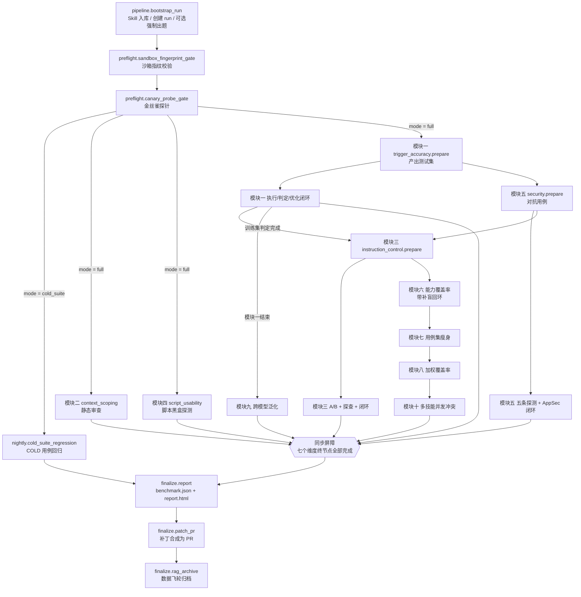
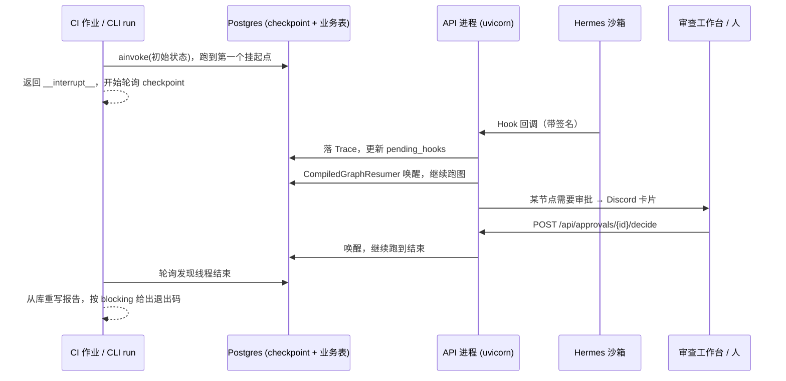

# 主图编排与 CI/CD 工作流：它们是什么、为什么这样设计、业务怎么流转

> 适用代码：`src/skill_evaluate/graph/`、`.github/workflows/`、`src/skill_evaluate/cli.py`、`src/skill_evaluate/api/app.py`
> 读者：想弄清楚"一次 Skill 评测从 PR 提交到出报告、提修复 PR，中间到底发生了什么"的开发与运维同学。

---

## 1. 一句话概括

- **graph（主图）** 是整个评测系统的"总调度"：把前置门禁、十个评测维度、报告、自动修复、数据飞轮串成**一张可暂停、可恢复、可跨进程继续执行**的 LangGraph 有向图。
- **workflow（GitHub Actions）** 是主图的"触发器和运行环境"：决定**什么时候**、**对哪些 Skill**、在**什么环境**里跑主图，以及跑完之后怎么归档结果、怎么做日常巡检。

两者的分工可以理解为：**workflow 管"何时何地跑"，graph 管"跑什么、按什么顺序、出了事怎么办"。**

---

## 2. 为什么需要一张主图（设计目的）

在主图出现之前，前面二十多份文档已经分别做好了各个零件：十个评测维度的子图、Judge / Optimizer / Generator 等公共 Agent、Hermes 回调、人工审批、长时记忆……但它们是**散装**的，存在几个"单独看每个零件都发现不了"的问题：

| 问题 | 如果没有主图统一处理会怎样 | 主图的解法 |
|---|---|---|
| 各维度互相依赖 | 模块三要用模块一出的题，模块七必须等模块六建好能力树，模块十要读模块八的负向约束——手动按顺序调用极易出错 | 用图的边把依赖关系固定下来 |
| 维度之间会"抢着改测试集" | 模块一、三、五、六都会调用 `ensure_test_suite()`，并行时两边同时出题，后激活的版本会把另一批用例悄悄丢掉 | 会改测试集的"准备节点"强制串行，其余照常并行 |
| 并行分支的汇合 | 逐条连边会让汇合节点每个前驱完成就跑一次，报告会先写出一份残缺版本 | 汇合一律用"多起点边"（同步屏障），全部完成才触发一次 |
| 执行过程会长时间停下 | 真实沙箱要等 Hermes 回调；优化闭环耗尽、Judge 冻结、共识未达成要等人审批——可能等几分钟到几天 | 所有停顿都是 LangGraph 动态 `interrupt()`，状态存进 Postgres checkpoint，任何进程都能接着跑 |
| 异常处理不一致 | 有的维度抛异常直接让流水线崩掉，人不知道该处理什么 | 所有节点统一套"审批 guard"，可人工恢复的异常自动变成审批卡片 |
| 结论要交付出去 | 维度结论散落在数据库各表，补丁只存在于临时工作副本 | 收尾阶段统一出报告、把补丁合成真实 PR、成功案例写进数据飞轮 |

所以主图的设计目的归结为三点：

1. **正确的编排**：依赖顺序、并行度、汇合时机都由图结构保证，而不是靠调用方自觉。
2. **可中断、可恢复**：评测是"长事务"，必须能停下等外部事件，再从断点精确继续，不重复、不遗漏。
3. **闭环交付**：从"测出问题"一直走到"给出报告 + 候选修复 PR + 沉淀经验"，而不是只吐出一堆分数。

---

## 3. 主图的整体结构

### 3.1 拓扑图

### 3.2 分阶段理解

| 阶段 | 节点 | 做什么 | 为什么在这里 |
|---|---|---|---|
| 入口 | `pipeline.bootstrap_run` | 解析 SKILL.md 入库、创建 `runs` 记录、建 Langfuse 顶层 trace；`--force-regenerate` 时重新出题 | 后面所有维度都从库里读 Skill；Hook 回调和审批按 `runs` 表定位要唤醒的线程，必须最先完成 |
| Phase 0 前置门禁 | 指纹校验 → 金丝雀探针 | 证明"评测用的沙箱环境是可信的" | 环境本身有问题时，后面十个维度的结论全都不可信，所以先证明、再评测；失败不记任何维度 FAIL |
| Phase A 并行 | 模块二、模块四、模块一 | 不依赖测试集的静态审查、脚本探测，以及产出测试集的模块一 | 互不依赖，尽早并行节省时间 |
| 测试集准备链（串行） | 模块一准备 → 模块五准备 → 模块三准备 → 模块六入口 | 依次确保测试集里有正反向用例、对抗用例、渐进式披露用例 | 防止同时出题导致用例丢失；只串行"准备"，后续执行照常并行 |
| 依赖型维度 | 模块九（在模块一结束后）、模块六→七→八→十（硬串行） | 跨模型对照、覆盖率分析、瘦身、加权、多技能冲突 | 模块九要读验证集结果；覆盖率三件套共享同一棵能力树且有严格先后；模块十要读模块八的负向约束 |
| 汇合 | 同步屏障 | 等七个维度终节点全部结束 | 保证报告只生成一次且完整 |
| Phase E 收尾 | 报告 → 补丁转 PR → 数据飞轮归档 | 交付结论与修复，沉淀成功经验 | 必须在全部结论落库后才能判断"是否完全通过"、"有哪些补丁可以合并" |

### 3.3 两种运行模式

主图只编译**一张**，靠状态里的 `_pipeline_mode` 分流：

- **full（完整评测）**：PR 或手动触发，跑全部十个维度。
- **cold_suite（Nightly 回归）**：前置门禁之后只跑 `nightly.cold_suite_regression`，重跑被模块七降级为 COLD 的冗余用例。

为什么不给 Nightly 单独编一张图：API 进程只持有一个已编译主图用来唤醒挂起线程。如果 Nightly 是另一张图，它挂起后被 Hook 回调唤醒时会用错图去恢复 checkpoint。

---

## 4. 主图的几个关键机制

### 4.1 状态合并：一张表装下所有维度

每个维度都有自己的私有状态键（`_trigger_*`、`_sec_findings`、`_coverage_ratio`……）。LangGraph 只保留 schema 里声明过的键，没声明的会被**静默丢弃**——最坏情况是安全维度的发现全丢，给出一份 PASS 的安全报告。

因此 `MainGraphState` 多重继承了全部维度的状态类型，并由单测保证"每个私有键都在、且互不重名"。另外把 `active_suite_version_id` 换成了能接受并发写入的 reducer，避免两个并行节点回写同一个版本号时 LangGraph 抛错。

### 4.2 挂起与唤醒：评测是一个"长事务"

所有停顿（等 Hermes 回调、等人工审批）都走 `suspend_and_wait()` → `interrupt()`，载荷里带 `wait_key`：

1. 节点挂起，图状态写入 Postgres checkpoint，当前 `ainvoke()` 返回。
2. 外部事件到达 API 进程（Hook 回调或工作台点击"批准"）。
3. `resolve_suspension()` 更新账本，调用 `CompiledGraphResumer`。
4. 唤醒器按 `wait_key` 找到对应的中断 id，`Command(resume=...)` 让图从断点继续。

主图里常有多个并行节点**同时**挂起（例如模块一和模块五都在等回调），按 `wait_key` 精确唤醒保证互不干扰。

编译期的 `interrupt_before` 刻意为空：静态断点会让每次运行都在固定节点前无条件停下，而且不会生成审批卡片，流水线会永远卡住。"哪些节点可能挂起"只作为说明写在 `SUSPENDABLE_NODES` 里。

### 4.3 审批 guard：异常变卡片

所有节点经 `ApprovalGuardedBuilder` 装配，节点抛出的可恢复异常会被统一接住：

| 异常 | 处理 |
|---|---|
| Judge 被冻结 | 阻塞卡片：人工调整后"解冻"重跑节点 |
| 出题连续坍塌 | 阻塞卡片：人工注入新种子后重跑 |
| 裁判共识未达成等 | 阻塞卡片：重试或放弃 |
| 基础设施不可信（前置门禁） | 只发通知，流水线停下，等运维修环境后整体重跑 |
| 人已经明确放弃 | 原样抛出，不再重复询问 |

### 4.4 跨进程执行：CLI 发起，API 进程接着跑

CLI 不需要一直"持有执行权"，它只是发起者和观察者；真正接着跑的是收到回调的 API 进程。两边读写同一套 checkpoint 表。

### 4.5 收尾三步的失败语义

| 节点 | 失败时 | 原因 |
|---|---|---|
| `finalize.report` | **让流水线失败** | 报告是这条流水线的产品，写不出来等于什么都没交付 |
| `finalize.patch_pr` | 不失败，结果写进报告尾部 | 此时结论已落库，`gh` 鉴权过期不应该让一次评测变成失败 |
| `finalize.rag_archive` | 不失败，结果写进报告尾部 | 数据飞轮是锦上添花，归档失败不影响本次结论 |

---

## 5. 主要业务流程（从 PR 到修复 PR）

下面以"开发者修改了一个 Skill 并提交 PR"为例，完整走一遍：

### 第 1 步：触发与解析

开发者修改 `skills/csv-cleaner/SKILL.md` 提交 PR → `skill_evaluate.yml` 触发 → `resolve` 作业执行 `skill-evaluate internal changed-skills`，用三点 diff 找出改动文件所属的 Skill 目录（离改动文件最近、含 SKILL.md 的祖先目录），同时判断基础镜像（Dockerfile / 黄金指纹）是否变更。

### 第 2 步：准备运行环境

对每个改动的 Skill 起一个矩阵任务：
1. 安装依赖，`db-init` 把数据库迁移到最新并建 checkpoint 表；
2. `sync-toolbox` / `sync-seed-anchors` 同步断言工具箱和种子锚点库，并建立记忆库索引；
3. 如果基础镜像变更，强制金丝雀实跑；
4. 后台启动 API 进程——它负责承接 Hermes 回调与审批决策，启动时装配主图并注册唤醒器。

### 第 3 步：发起评测

`skill-evaluate run --skill-path skills/csv-cleaner`：
1. 读取 Skill 计算 `skill_id` / `version_ref`，生成 `run_id`，线程 id 为 `skill_id:run_id`；
2. 调用主图 `ainvoke()`。

### 第 4 步：入口与前置门禁

`bootstrap_run` 把 Skill 入库、建 `runs` 记录 → 指纹门禁比对沙箱环境与 `golden_fingerprint.json` → 金丝雀探针让沙箱读一个已知文件并逐字校验。任何一道失败：发运维通知、流水线停下（退出码 4），不产生任何维度结论。

### 第 5 步：十个维度评测

- 模块二（上下文范围）、模块四（脚本易用性）立即开跑；
- 模块一准备测试集（首次会出题，之后默认复用），执行三次冗余触发、判定，训练集失败时进入 description 优化闭环；
- 模块五准备对抗用例，并行跑五条红队探测，发现高危问题进入 AppSec 修复闭环（修复后还要做强制功能回归）；
- 模块三做 A/B 对比、效率诊断、渐进式披露探查，必要时进入正文优化闭环；
- 模块六建能力树、算覆盖率、反向补盲 → 模块七折叠冗余用例、分析组合覆盖 → 模块八权重分级、负向约束覆盖、生成可追溯性矩阵 → 模块十测多技能并发冲突，基石 Skill 被拖垮时挂起等人确认；
- 模块九在模块一结束后做异构模型、参数扰动、随机消融三组对照。

期间任何需要外部事件的地方都会挂起、再被 API 进程唤醒（见 4.4）。每个维度结束时把结论（状态、分数、发现、是否阻断）写入 `dimension_results`。

### 第 6 步：出报告

七个维度终节点全部完成后，`finalize.report` 聚合数据库里的维度结论，写出 `benchmark.json`（机器读，决定是否阻断）和 `report.html`（人读），头部附带前置门禁证明摘要，并透传测试集版本漂移告警、覆盖率摘要。

### 第 7 步：补丁转 PR

`finalize.patch_pr` 收集本次运行被采纳的补丁（模块五安全补丁 → 模块一 description 补丁 → 模块三正文补丁，按此优先级）：
1. 从回归验证过的**工作副本**还原出真实文件内容，多份补丁先检查能否叠加，冲突的写进 PR 正文的"未合入"清单；
2. 在独立 git worktree 里基于被评测的那个提交拉出 `skill-evaluate/auto-fix/<skill>/<run>` 分支、提交、推送；
3. 用 `gh` 创建 PR（目标是作者的 PR 分支），正文包含每个补丁的修复理由、回归结论和报告链接；
4. PR **不会自动合并**，由人走正常 Code Review。

### 第 8 步：数据飞轮归档

`finalize.rag_archive`：只有当所有阻断型维度全部 PASS 时，才把这份 Skill 的描述、正文分块和优质用例写入 `successful_skill_archive`，供以后新 Skill 冷启动出题时参考。随后重写一次报告，补上 PR 结果和归档结果。

### 第 9 步：CI 收尾

CLI 轮询到线程结束，在自己的工作目录重写报告（保证 CI 一定拿得到文件），按结果退出：

| 退出码 | 含义 | PR 上看到的 |
|---|---|---|
| 0 | 没有阻断项 | 检查通过 |
| 1 | 有阻断型维度 FAIL | 检查失败，阻止合并 |
| 2 | 评测系统自身故障 | 检查失败，找运维 |
| 3 | 仍在等审批或回调 | 检查失败并提示：去工作台处理后带 `run_id` 重新触发 |
| 4 | 被人工放弃或前置门禁拒绝 | 检查失败 |

无论成败，`benchmark.json`、`report.html`、可追溯性矩阵和 API 日志都会作为制品归档 90 天。

---

## 6. 四个 workflow 各自的作用

### 6.1 `skill_evaluate.yml` —— PR 评测主流程

| 项 | 内容 |
|---|---|
| 触发 | PR 改动 `skills/**` 下的 SKILL.md / scripts / references，或 Dockerfile、黄金指纹；也可手动触发（指定 Skill、强制出题、续跑某个 run_id） |
| 作业 | `resolve`（解析改动的 Skill）→ `evaluate`（每个 Skill 一个矩阵任务） |
| 作用 | **合并门禁**：决定这次 Skill 修改能不能合并；同时产出报告和候选修复 PR |
| 与主图的关系 | 以 `full` 模式运行主图，并在作业内拉起 API 进程承接回调 |
| 注意 | 同一分支的评测不并发、也不中途取消（取消会留下挂起的线程）；生产环境应连接常驻数据库并使用 Hermes 能访问到的自托管 runner |

### 6.2 `scheduled_maintenance.yml` —— 超时回调巡检（每 5 分钟）

| 项 | 内容 |
|---|---|
| 作用 | 找出 `pending_hooks` 里等待过久、始终没收到 Hermes 回调的记录，构造"超时失败"的 Trace 并唤醒对应线程 |
| 为什么需要 | 沙箱崩溃或网络丢包时回调永远不会来，没有巡检的话流水线会永久挂起 |
| 与主图的关系 | 不是主图节点（不属于某一次运行），但执行前会装配主图并注册唤醒器，唤醒后在本作业里把流水线继续跑下去 |
| 依赖 | 常驻数据库；未配置时自动跳过 |

### 6.3 `judge_health_check.yml` —— Judge 健康巡检（每 6 小时）

| 项 | 内容 |
|---|---|
| 作用 | 统计默认 Judge 配置在黄金基准题上的失误率，超过阈值就冻结该配置并发 `judge_frozen` 告警 |
| 为什么需要 | 裁判本身会退化（模型更新、Prompt 漂移）；一个已经会误判的裁判给出的结论不能进报告 |
| 与主图的关系 | 独立巡检；冻结后，主图里任何调用该 Judge 的节点都会被 guard 接成"解冻审批"卡片 |
| 失败含义 | 退出码 1 = Judge 不健康，值班同学在 Actions 页面也能看到 |

### 6.4 `nightly_cold_suite.yml` —— 周末 COLD 用例回归（每周日 02:00 UTC）

| 项 | 内容 |
|---|---|
| 作用 | 对 `skills/` 下每个 Skill 重跑被模块七降级为 COLD 的冗余用例 |
| 为什么需要 | 模块七为了降本把"能力路径完全相同"的冗余用例移出日常评测，但被折叠的边界用例可能悄悄坏掉，需要定期抽查 |
| 与主图的关系 | 以 `cold_suite` 模式运行同一张主图：前置门禁（金丝雀强制实跑）→ COLD 回归 → 报告 |
| 失败含义 | 结论维度 `cold_suite_regression` 不阻断任何合并，只进报告；发现失败时建议人工评估是否把用例恢复为日常用例 |

### 6.5 workflow 与主图的对应关系总览

| workflow | 调用的 CLI | 是否运行主图 | 模式 |
|---|---|---|---|
| skill_evaluate | `internal changed-skills`、`db-init`、`sync-*`、`run` | 是 | full |
| scheduled_maintenance | `internal reap-pending-hooks` | 只装配用于唤醒，续跑已有线程 | — |
| judge_health_check | `internal judge-health-check` | 否 | — |
| nightly_cold_suite | `internal changed-skills --all`、`internal run-cold-suite` | 是 | cold_suite |

---

## 7. 三个典型场景

### 场景一：一切顺利

PR 提交 → 解析出 1 个 Skill → 门禁通过 → 十个维度全部 PASS → 报告 overall PASS → 没有补丁，跳过 PR → 全部阻断维度 PASS，写入数据飞轮 → 退出码 0，PR 检查变绿。

### 场景二：触发率不达标，自动修复后提 PR

模块一训练集有 3 条正向用例没触发 → Optimizer 改写 description → 重测通过 → 验证集用补丁后的版本跑，达标 → 维度结论 PASS（补丁已验证）→ 收尾时把新 description 合成进 SKILL.md，向作者分支提一个自动修复 PR → 作者 Review 后合并到自己分支，再次触发评测。

### 场景三：需要人工介入

模块五 AppSec 闭环三轮补丁都没通过功能回归 → 发出"是否采纳补丁"的阻塞卡片，流水线挂起 → CLI 等待到超时，退出码 3，PR 检查提示去工作台 → 安全负责人在工作台查看 diff 后选择 adopt → API 进程唤醒线程继续跑完 → 负责人用 `run_id` 手动重新触发 workflow，CLI 发现线程已结束，直接读取结果给出最终退出码（不重跑）。

---

## 8. 设计取舍小结

| 决策 | 选择 | 放弃的方案及原因 |
|---|---|---|
| 维度装配方式 | 平铺进一张主图 | 子图嵌套：审批 guard 包不到子图内部节点，异常无法变成卡片 |
| 测试集并发 | 准备节点串行 | 全并行：会发生用例丢失且不报错 |
| 汇合 | 多起点边同步屏障 | 逐条连边：汇合节点重复执行、报告残缺（实施期还据此修复了模块三的同类缺陷） |
| 人工停顿 | 动态 `interrupt()` | 静态 `interrupt_before`：每次运行无条件停下且没有卡片 |
| 执行进程 | CLI 发起 + API 进程续跑，共享 checkpoint | 单进程等待：Hook 回调和审批决策都打到 API 进程，CLI 收不到 |
| 补丁落地 | 从验证过的工作副本还原文件并提 PR，不自动合并 | 直接 `git apply` 补丁 diff：diff 针对的是字符串字段且逐轮叠加，必然失败；自动合并越过了人的决策边界 |
| Nightly | 同一张图的另一种模式 | 独立图：唤醒时会用错图恢复 |
| 定时巡检 | 独立 workflow，不做主图节点 | 做成节点：巡检不属于任何一次运行 |

---

## 9. 运维速查

- **启动 API 进程**：`uvicorn skill_evaluate.api.app:app`，日志出现 `api_graph_resumer_registered` 才说明唤醒器就绪。
- **常驻数据库**：测试集复用、Judge 健康、数据飞轮、跨作业唤醒都依赖它；CI 默认的临时数据库只适合冒烟。
- **Hermes 回调地址**：配置 `SKILLEVAL_API_INTERNAL_BASE_URL`，必须能从沙箱访问到。
- **开启自动修复 PR**：`SKILLEVAL_PIPELINE_PATCH_PR_ENABLED=true`（本地默认关闭）。
- **续跑/重新观察**：`skill-evaluate run --skill-path <path> --run-id <id>`。
- **发布前**：确认没有进行中的挂起线程再改动主图节点名——checkpoint 里记着旧节点名，新图无法恢复它们。

更细的接入细节（新增维度的步骤、完整配置项、Secrets 清单）见 `docs/dev/interfaces/24_main_graph_and_ci_cd.md`。
