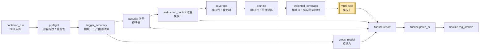
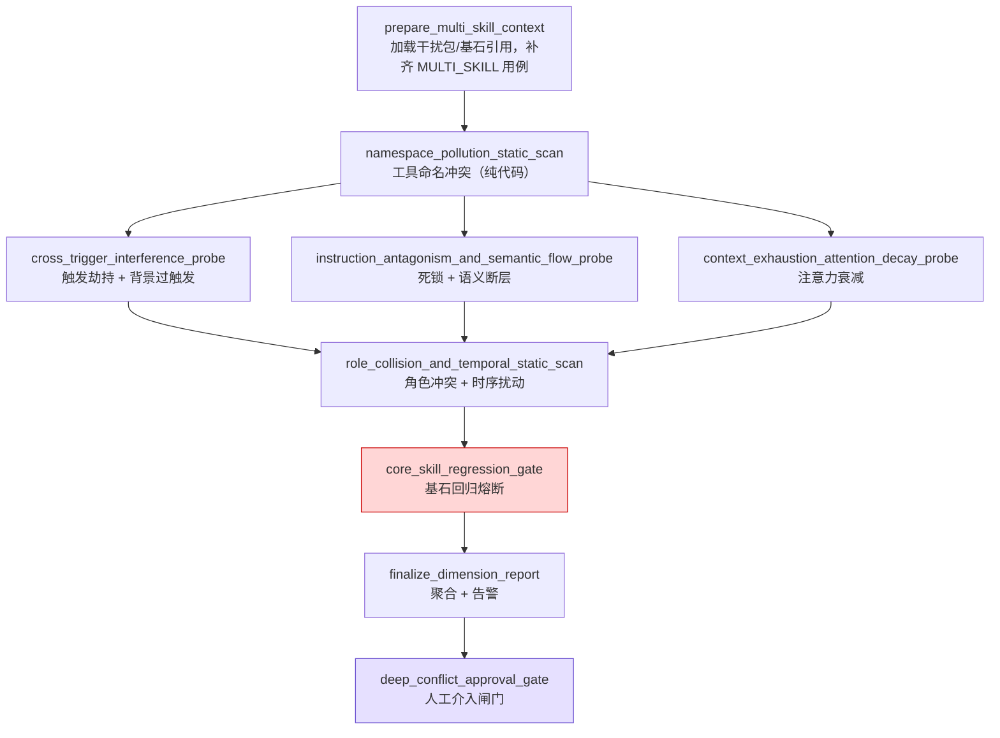
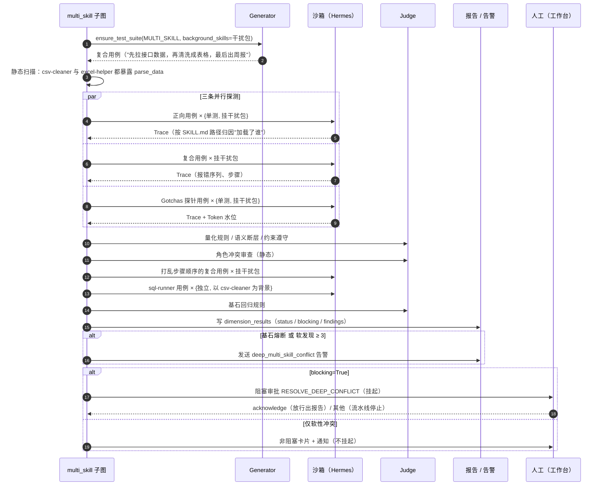

# multi_skill 子图：多技能并发加载与上下文冲突防范（模块十）

> 代码位置：`src/skill_evaluate/nodes/multi_skill/`
> 关联组件：`executors/skill_attribution.py`（加载归因）、`observability/alerts.py`（告警分发）、
> `agents/generator/prompts/multi_skill.jinja`（复合用例出题）、`agents/mini/templates/multi_skill.py`（三个评审模板）
> 设计文档：`docs/dev/20_模块十_多技能并发加载与上下文冲突防范评测.md`
> 接入文档：`docs/dev/interfaces/20_multi_skill_conflict.md`

---

## 1. 一句话说清楚

**这个子图回答一个问题：这份 Skill 单独测没问题，但和别的 Skill 同时装进同一个 Agent 之后，它还能正常工作吗？会不会把别的 Skill 搞坏？**

前面九个维度都在"真空"里测 Skill：沙箱里只挂着被测的那一份 `SKILL.md`。真实环境不是这样的，一个 Agent 往往同时装着十几个 Skill。这时会出现单测里根本看不到的问题：

- 别的 Skill 的 description 和它太像，**活被抢了**（触发劫持）；
- 一个要求"只输出 JSON"，另一个要求"一律用 Markdown"，Agent **左右为难、反复报错**（指令拮抗）；
- 上下文被塞满，Skill 里那条关键的"避坑规则"**被模型忘了**（注意力衰减）；
- 两个 Skill 都暴露了叫 `parse_data` 的工具，**调到哪个全看运气**（命名污染）；
- 最严重的：新 Skill 一合进来，系统里**最常用的核心 Skill 反而不触发了**（基石回归）。

multi_skill 子图把评测环境从"单技能真空"切换到"多技能共存的嘈杂环境"，专门把这类问题找出来。

---

## 2. 设计目的

| 目的 | 具体做法 |
|---|---|
| **暴露"单测完美、上线崩溃"的缺陷** | 同一条用例分别在"只挂目标 Skill"和"同时挂基准干扰包"两种环境下执行，对比结果 |
| **控制组合爆炸** | 不做技能库两两组合。只和一个**固定的基准干扰包**（3~5 个代表性技能）对抗，成本 O(1)；每项探测都有独立的条数上限 |
| **保护存量能力** | 反过来测"引入新 Skill 后，Top 5 核心 Skill 还好不好"，这是**唯一阻断合并**的检查 |
| **结论要能归因** | 每项动态检测都配基线（单测 / 原顺序 / 独立执行），只有"基线正常、并发才出问题"才算本维度的发现 |
| **不冤枉人** | 沙箱故障、证据矛盾一律记"证据不足"交人工；主观、责任不清的冲突只告警，不阻断 |
| **给人可用的线索** | 双路 Trace 按固定号段落库，告警 payload 带齐发现，工作台可以直接并排比对 |

---

## 3. 在整个评测流程中的位置

在主图（`graph/main.py`）里它是**覆盖率分区的最后一站**：

- **必须排在模块八（weighted_coverage）之后**：注意力衰减探测要用模块八映射好的"负向约束 → 反事实用例"，拿现成用例当探针。顺序反了不报错，但这项探测会被跳过，维度只能给出"需人工复核"。
- **依赖模块一的测试集**（`active_suite_version_id`），并在其上补一类自己专用的 `MULTI_SKILL` 复合用例。
- 它的终节点 `multi_skill.deep_conflict_approval_gate` 是 `finalize.report` 同步屏障的前驱之一：不等它结束，总报告不会生成。
- 它是**第 2 层（评测维度层）的最后一个维度**。之后就是报告汇总、补丁转 PR、长时记忆归档。

---

## 4. 图结构

- 三条动态探测互不依赖，**并行**执行，共用一个沙箱并发信号量（并发上限不会被放大三倍）。
- 汇合点 `role_collision_and_temporal_static_scan` 用多起点边，**等三条支路都完成**才执行，因为时序扰动要读指令拮抗产出的"健康用例"清单。
- 基石熔断**串在最后**而不是并入扇出：它跑的是核心 Skill 自己的用例，沙箱量大，串行执行时峰值并发更可控。
- 子图无环，没有静态中断点；只有闸门节点在基石熔断时**动态**挂起。

---

## 5. 九个节点分别做什么

| # | 节点 | 做什么 | 怎么判 | 执行成本 |
|---|---|---|---|---|
| 1 | `prepare_multi_skill_context` | 按配置取基准干扰包、基石 Skill 的最新入库版本（剔除自己和未入库的）；调用 `ensure_test_suite(extra_categories=[MULTI_SKILL])`，只在该类用例一条都没有时才出题 | — | 可能 1 次出题 LLM 调用 |
| 2 | `namespace_pollution_static_scan` | 扫描各 Skill 暴露的工具名，找同名工具（大小写不敏感） | 量化规则 `namespace_collision`；只计涉及被测 Skill 的冲突，未加前缀的工具名给建议 | 0 |
| 3 | `cross_trigger_interference_probe` | 取前 N 条正向用例，"单测"与"挂干扰包"各跑一次 | `trigger_hijack`：单测触发、并发不触发 → 劫持；`background_overtrigger`：并发时干扰技能被意外加载 | 2×N 次沙箱 |
| 4 | `instruction_antagonism_and_semantic_flow_probe` | 复合用例挂干扰包执行 | `instruction_deadlock`：错误动作 A→B→A 往返 ≥ 3 次 → 死锁；LLM 模板 `semantic_flow_friction`：是否为了格式转换浪费大量步骤 | N 次沙箱 + N 次裁判 |
| 5 | `context_exhaustion_attention_decay_probe` | 从能力树挑一条"诱导踩坑"的反事实用例，单测、并发各跑一次 | LLM 模板 `negative_constraint_adherence` 判两次执行是否守住约束；`attention_decay`：单测守住、并发违反 → 衰减。另外标注 Token 水位 | 2 次沙箱 + 2 次裁判 |
| 6 | `role_collision_and_temporal_static_scan` | ① 被测 SKILL.md 与干扰包的角色/风格预设做静态对比；② 把健康复合用例的步骤顺序打乱后重跑 | LLM 模板 `role_persona_conflict`；`temporal_fragility`：原顺序健康、打乱后崩溃/未触发/死锁 → 拓扑脆弱 | 1 次裁判 + ≤3 次沙箱 |
| 7 | `core_skill_regression_gate` | 每个核心 Skill 抽 5 条自己的正向用例，"独立执行"与"以被测 Skill 为背景"各跑一次 | `core_regression`：并发触发率 < 80% **且** 低于独立执行时的触发率 → 熔断 | 2×5×核心数 次沙箱 |
| 8 | `finalize_dimension_report` | 汇总所有发现，写 `dimension_results`，满足条件时发深度冲突告警 | 见第 7 节 | 0 |
| 9 | `deep_conflict_approval_gate` | 按告警里的 `blocking` 分流：阻塞审批 / 只发通知 / 直接放行 | 见第 8 节 | 0 |

判定全部经过 Judge Agent：7 条量化规则 + 3 个 LLM 评审模板，都声明为 `ROUTINE`（单副本）。三个 LLM 判定只产生不阻断的软发现，不值得花 3 倍 Token 做共识投票；唯一阻断的熔断是纯算术，不经过 LLM。

---

## 6. 主要业务流程（以一次 PR 为例）

假设开发者提交了新 Skill `csv-cleaner`。运维配置的基准干扰包是 `excel-helper`（功能相近）、`report-writer`（输出 Markdown）、`json-only-api`（只输出 JSON）；基石 Skill 是 `sql-runner` 等 5 个。

逐步说明：

1. **准备上下文**。读取干扰包与基石 Skill，状态里只存 `(skill_id, version_ref)` 引用，不存 SKILL.md 全文，避免 Checkpoint 膨胀。如果被测 Skill 的用例集里还没有 `MULTI_SKILL` 类别，就让 Generator 出一批"必须和干扰包中某个 Skill 协同、有先后步骤和数据传递"的复合题。这批题同时供指令拮抗、语义断层、时序扰动三项使用，不重复出题。

2. **先做最便宜的静态检查**。命名冲突不需要起沙箱，排在最前。它常常是后面动态现象的根因：两个 `parse_data` 工具很可能直接导致劫持或交替报错。先在报告里写出来，读报告的人就能把根因和症状对上。

3. **三条动态探测并行**：
   - **触发劫持**：例如"帮我把这份导出的表格去重"。单测时加载了 `csv-cleaner`；挂上干扰包后 Agent 只读了 `excel-helper` 的 SKILL.md，记一条 `[劫持]`。如果干扰包里的技能被额外激活，记 `[背景过触发]`。如果单测时就没触发，那是模块一的问题，只写说明，不计入本维度。
   - **指令拮抗**：复合任务执行中，`validate_json.py` 和 `lint_md.py` 交替报错 A→B→A→B→A，记 `[死锁]`。同一条 Trace 再交给 LLM 看"是否花了大量步骤写临时转换脚本"，是就记 `[语义断层]`，并给出应补进 SKILL.md 的中间数据格式建议。
   - **注意力衰减**：取能力树上"删除前必须确认路径存在"这条约束的反事实用例。单测时 Agent 先确认了路径；并发时直接删了，记 `[注意力衰减]`，附上当时的 Token 水位。如果水位远没到挤兑阈值，报告会注明"本次没发现衰减的结论强度有限"。

4. **角色冲突与时序扰动**。静态审查发现 `csv-cleaner` 写着"你是严谨的数据清洗专家，拒绝任何猜测"，与干扰包里某个"发散导师"式技能冲突，记 `[角色冲突]`，并给出改写成客观过程指导的建议。时序扰动只挑原顺序下执行健康的复合用例，把"先 A，然后 B，最后 C"改成"C；A；B"重跑。崩了就记 `[拓扑脆弱]`，建议在 SKILL.md 里补显式 Checklist。

5. **基石回归熔断**。拿 `sql-runner` 自己的 5 条正向用例：独立执行 5/5 触发，以 `csv-cleaner` 为背景只有 2/5。40% 低于 80% 的安全下限，也低于独立执行的 100%，因此记 `[基石熔断]`：这是 `csv-cleaner` 引入导致的退化。如果 `sql-runner` 独立执行时本来就只有 60%，则不归咎于本次 PR。

6. **收尾与告警**。写入维度结果：有 `[基石熔断]` 时 `status=FAIL`、`blocking=True`。存在熔断，或软发现累计 ≥ 3 条时，发送 `deep_multi_skill_conflict` 告警（告警发送失败不影响落库）。

7. **人工介入闸门**。
   - `blocking=True`：生成阻塞式审批卡片并挂起流水线。开发者在工作台并排比对单跑与并发的 Trace 后，选择 acknowledge 让流水线跑完出报告，或者放弃。acknowledge **不改变结论**，报告里的阻断项照样阻止合并。
   - 只有软冲突：写一张非阻塞卡片并通知，流水线不等待。
   - 什么都没触发：直接放行。

---

## 7. 结论口径

| 情形 | 维度 status | blocking |
|---|---|---|
| 出现 `[基石熔断]` | FAIL | **True** |
| 其余任一发现：劫持、过触发、死锁、语义断层、衰减、角色冲突、拓扑脆弱、命名污染 | FAIL | False |
| 有探测被跳过（干扰包/基石未配置、没有用例、没有能力树）、证据不足、状态键缺失 | NEEDS_HUMAN_REVIEW | False |
| 以上都没有 | PASS | False |

几条贯穿全子图的原则：

- **基线正常、变体异常才算发现**。参照臂本身就不对，是别的维度的问题，不重复扣分。
- **失败态 Trace 不是证据**。沙箱超时或故障时，`loaded_skill_md=False` 会凭空造出劫持和熔断，所以记为证据不足。唯一例外是时序扰动：参照臂在同一环境下健康，打乱顺序后崩溃本身就是被测现象，报告会提示人工排除基础设施故障。
- **"加载了谁"要归因**。沙箱里同时有多份 SKILL.md，只看"读了某个 SKILL.md"会把读干扰技能误当成读目标技能。归因按挂载目录名把每次读取对应到具体 Skill；证据互相矛盾时记证据不足，不去猜。
- **配置缺失不等于通过**。干扰包为空时，报告是"需人工复核"，不是 PASS，否则等于悄悄关掉了这个维度。
- `score=None`：七类性质不同的检测凑不出一个有意义的分数。

---

## 8. 为什么只有基石熔断阻断？

| | 基石熔断 | 其他冲突 |
|---|---|---|
| 因果方向 | 清楚：新 Skill 进来，老 Skill 变差 | 模糊：是被测 Skill 写得不好，还是干扰包本身有问题？ |
| 误伤风险 | 低（还要求比独立执行更差） | 高，自动阻断会让大量 PR 被冤枉 |
| 对后续结果的影响 | 合进来会拖垮系统级能力，后面的分数没有合并意义 | 不影响其他维度的结论 |
| 处理方式 | 阻断 + 阻塞式人工审批 | 高优先级告警 + 非阻塞卡片 |

这延续了项目的分层原则：**确定性硬伤阻断，复杂或主观问题交给人**。是否挂起流水线，看的是"不等人确认，还能不能产出有意义的结果"，而不是"问题重不重要"。

---

## 9. 产出物

| 产出 | 去向 | 谁用 |
|---|---|---|
| `dimension_results`（维度名 `multi_skill_conflict`） | 数据库 → 总报告 | CI 是否阻断合并、读报告的人 |
| 执行 Trace，按号段落库：230/231 劫持单测/并发，232 拮抗，233/234 衰减单测/并发，235 时序，236/237 基石独立/并发 | `execution_traces` | 审查工作台的"单跑 vs 并发"比对 |
| FAIL 判定记录（`subject_id` 前缀 `multi_skill_*`） | `judge_verdicts` | 人工回查每条结论的依据 |
| 深度冲突告警 `deep_multi_skill_conflict` | `AlertDispatcher`（Discord 等） | 开发者第一时间获知 |
| 审批卡片 `RESOLVE_DEEP_CONFLICT` | 审批表 + 工作台 | 人工裁定 / 知悉 |

---

## 10. 成本与配置

默认配置下，单次运行的上限约为：**71 次沙箱执行**（劫持 10 + 拮抗 6 + 衰减 2 + 时序 3 + 基石 50）、**9 次裁判调用**、**0~1 次出题调用**。并发共用 `SKILLEVAL_EXECUTOR_MAX_CONCURRENT_SANDBOXES`。

| 配置（前缀 `SKILLEVAL_MULTISKILL_`） | 默认 | 含义 |
|---|---|---|
| `NOISE_PACK_SKILL_IDS` | `[]` | 基准干扰包，运维维护，建议 3~5 个且**固定不变** |
| `CORE_SKILL_IDS` | `[]` | 基石 Skill（Top 5），需各自有测试集 |
| `MAX_HIJACK_PROBE_CASES` | 5 | 劫持探测用例数 |
| `MULTI_SKILL_CASE_COUNT` / `MAX_ANTAGONISM_PROBE_CASES` | 6 / 6 | 复合用例出题数 / 探测数 |
| `MAX_TEMPORAL_PROBE_CASES` | 3 | 时序扰动用例数 |
| `DEADLOCK_MIN_PING_PONG` | 3 | 交替报错阈值 |
| `CORE_REGRESSION_SAMPLE_SIZE` / `CORE_REGRESSION_MIN_RATE` | 5 / 0.8 | 熔断样本数 / 安全下限 |
| `CONTEXT_FLOOD_TARGET_TOKENS` | 80000 | 挤兑水位参考值（只做证据强度标注） |
| `DEEP_CONFLICT_ALERT_THRESHOLD` | 3 | 软发现达到多少条时发告警 |

阻断策略**不是配置项**。它写死在代码常量里，要改就得走代码评审。

---

## 11. 已知边界

- **需要沙箱配合挂载约定**：每个 Skill 挂在以 `skill_id` 命名的独立目录，并由沙箱显式上报目标 Skill 是否加载。不满足时不会得出错误结论，但很多判定会落入"证据不足"。
- **跨技能状态突变尚未侦测**：比如 Skill A 改了环境变量或覆写了共用文件、导致 Skill B 读到脏数据。这需要沙箱在步骤之间上报文件 Hash 和环境变量快照，现有 Trace 只有最终的文件变更清单。
- **注意力衰减只告警，不自动修复**：不会自动打回 Optimizer 精简 Token 或强制渐进式披露。
- **挤兑压力取决于干扰包规模**：系统不会往上下文里塞无关填充物来人为撑高水位，干扰包太小时衰减结论偏弱，报告会注明。
